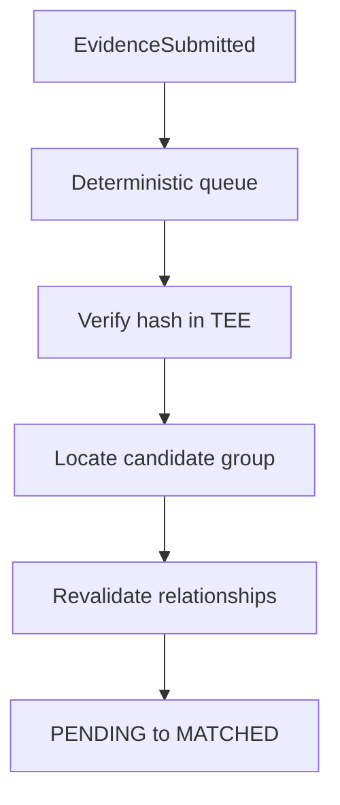
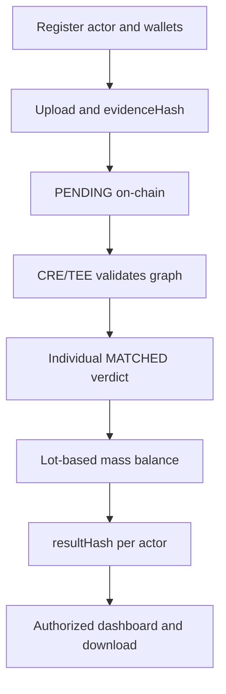

# ExploreChem

Confidential traceability infrastructure for rare-earth supply chains, combining private documents, verifiable graph correlation, chain-of-custody evidence, lot-based mass balance, and minimal blockchain anchoring.

> ExploreChem is being developed for ETHOnline 2026. Company names, lot identifiers, document references, quantities, and results shown in the demonstration are fictional.

## Overview

ExploreChem allows independent organizations to prove the continuity and consistency of a material supply chain without publishing commercial documents, relationships, quantities, or chemical composition on-chain.

```text
private document
→ evidenceHash anchored on-chain
→ confidential correlation inside CRE/TEE
→ private graph revalidated
→ lot-based mass balance
→ versioned resultHash anchored on-chain
```

The system separates responsibilities:

- **ExploreChem:** product experience, company registration, permissions, private metadata, and history;
- **Chainlink CRE + TEE:** document integrity checks, deterministic extraction, graph correlation, and confidential calculation;
- **Blockchain:** minimal identity, authorship, integrity, state, and result commitments;
- **DPP:** the evolving Digital Product Passport associated with a product or material lot;
- **Invited client:** access to an authorized dashboard and downloadable reports, without evidence upload privileges.

> The blockchain is not ExploreChem's corporate database. It stores only what is required to prove submission, integrity, state, and result history.

---

## 1. Problem

Rare-earth supply chains involve miners, carriers, laboratories, processors, recyclers, manufacturers, and buyers. Each participant produces documents, but those documents are normally stored in isolated systems and may contain commercially sensitive information.

Publishing complete records on a public blockchain would expose relationships that companies may not be allowed or willing to disclose. Keeping everything only in a conventional database would make the result easier for a database administrator to alter without leaving a public trace.

ExploreChem combines private processing with public cryptographic commitments:

- documents and operational data remain private;
- hashes prove which document version was submitted;
- independent documents are correlated inside a protected environment;
- mass balance is calculated by lot and chemical element;
- each authorized participant receives its own publicly anchored, privately salted result commitment;
- previous result versions remain available instead of being overwritten.

---

## 2. Goals

The MVP is designed to:

- identify the actor and wallet responsible for each evidence submission;
- confirm that a retrieved document is byte-for-byte identical to the anchored document;
- correlate documents submitted by different supply-chain actors;
- represent verified transfers, analyses, transformations, returns, and recycling relationships;
- preserve the commercial graph outside the public blockchain;
- prevent the same physical mass from being counted more than once;
- calculate a mass balance for a specific lot;
- append new result versions without deleting previous ones;
- restrict each participant to an authorized view of the chain;
- provide invited clients with read-only dashboards and downloads.

The MVP does not claim that cryptography alone proves that a physical event happened. It proves document integrity and rule-based consistency. Material truth still depends on authorized issuers, audits, sensors, official sources, and external enforcement.

---

## 3. Digital Product Passport

The **DPP — Digital Product Passport** is associated with a product or material lot. It is not the company's registration record.

An actor is registered once and may contribute evidence to several DPPs:

```text
registered actor
→ submits evidence for different lots
→ evidence contributes to the corresponding DPPs
→ each DPP evolves through append-only result versions
```

The complete DPP remains off-chain. The blockchain stores only opaque identifiers, document commitments, minimal states, and result commitments.

---

## 4. Participants and visibility

ExploreChem may receive evidence from:

- mining companies;
- laboratories;
- carriers;
- processors and refiners;
- recyclers;
- manufacturers;
- other authorized supply-chain participants.

`actorType` is private operational data and does not need to be published on-chain.

### ExploreChem administrator

- registers organizations and actors;
- associates authorized wallets;
- assigns roles and permissions;
- monitors evidence, correlation runs, DPPs, and mass-balance results.

### Actor or supplier

- uploads its own documents;
- associates submissions with the appropriate lot;
- monitors its own evidence processing;
- sees its own evidence, direct counterparties, and authorized result;
- does not automatically see earlier or later participants in the supply chain.

### Carrier

- records pickup, received mass, delivered mass, delivery time, and incidents;
- confirms custody between sender and recipient;
- does not create a second physical mass flow merely by transporting the material;
- sees only transfers assigned to it.

### Lot operator

- monitors authorized correlated evidence;
- reviews inputs, outputs, inventories, losses, and yield;
- generates a verifiable mass-balance report;
- accesses the private graph only within its operational scope.

### Invited client

- receives access from the company responsible for a specific result;
- sees only the authorized dashboard and provenance summary;
- downloads the report and integrity proof;
- cannot upload, modify, or delete evidence;
- cannot access other lots or the complete private graph.

### Visibility horizon

| Profile | Visible scope |
|---|---|
| CRE/TEE | Private graph required for correlation and calculation |
| Company or actor | Own evidence, direct relationships, and authorized results |
| Carrier | Assigned pickup, delivery, and incident information |
| Invited client | Specifically shared dashboard and downloads |
| Public blockchain observer | Opaque actor/evidence/result IDs, wallets, hashes, states, revision links, calldata, events and block times |

The private correlation identifier never grants access. Authorization is enforced independently by application and database policies.

---

## 5. Actor identity

The company registration is created in ExploreChem, while the blockchain stores only a minimal logical identity.

```text
company opens ExploreChem
→ administrative wallet is connected
→ company profile is created off-chain
→ actorId is assigned
→ authorized wallets are associated with actorId
```

Private company data may include:

- legal name;
- tax identifier;
- `actorType`;
- facilities and operating locations;
- responsible personnel;
- administrative information;
- internal access rules.

Minimal on-chain identity:

```solidity
struct ActorIdentity {
    bytes32 actorId;
    address controller;
    uint64 createdAt;
}

mapping(bytes32 actorId => mapping(address wallet => bool authorized))
    public authorizedWallets;
```

`actorId` is a stable logical identity. An organization can add or replace wallets without changing its historical identifier.

Actor registration does not use evidence states such as `PENDING`, `MATCHED`, `FAILED`, or `REVOKED`. Wallet authorization is managed directly by the identity registry.

`registerActor` is owner-only. Connecting a wallet or choosing a role in the UI
does not register an actor on-chain. A wallet proves control of a key, not a
verified company identity or mining authorization. The demonstration uses
fictional organizations; real-world identity checks and customer onboarding
are production requirements, not claimed as completed by this MVP.

---

## 6. Evidence submission

When an actor uploads a document, ExploreChem:

1. preserves the original file in private storage;
2. calculates `evidenceHash` from the exact original bytes;
3. extracts operational metadata;
4. stores the document, metadata, and extractor version off-chain;
5. generates an opaque `evidenceId`;
6. requests an authorized wallet to submit the minimal evidence on-chain;
7. emits `EvidenceSubmitted`, the primary trigger for correlation.

Evidence may include:

- invoice or commercial document;
- origin and quantity declaration;
- laboratory report;
- transport document;
- proof of delivery;
- refining or purification report;
- transformation record;
- manufacturing or recycling record.

- 
## Navegação do ator de demonstração

O MVP inclui um seletor de atores abaixo do formulário de registro. Após o registro de um ator, o operador pode selecioná-lo para navegar pelo sistema usando a função e o escopo de visibilidade do ator.

Este mecanismo de demonstração evita a necessidade de um login e carteira separados para cada participante fictício. A carteira conectada assina a transação de registro, enquanto cada ator recebe seu próprio ID único e persistente `actorId`.

Trata-se de um identificador opaco gerado aleatoriamente, armazenado como `actor_id` no Supabase e registrado como `actorId` na blockchain. É único, mas não é um token transferível, stablecoin, NFT, credencial ou chave de acesso.

O seletor de atores destina-se apenas à demonstração do MVP. Em produção, será substituído por identidade verificada, contas autenticadas, autorização de carteira e políticas de acesso ao backend/RLS.
---

## 7. On-chain data

Each document submission records only:

```text
evidenceId
actorId
submittedBy
evidenceHash
status
createdAt
matchedAt
```

Conceptual structure implemented by the contract:

```solidity
enum EvidenceStatus {
    NONE,
    PENDING,
    MATCHED
}

struct Evidence {
    bytes32 evidenceId;
    bytes32 actorId;
    address submittedBy;
    bytes32 evidenceHash;
    EvidenceStatus status;
    uint64 createdAt;
    uint64 matchedAt;
}
```

`NONE` is the Solidity zero value used to distinguish a missing mapping entry. A valid new evidence record starts as `PENDING`.

The contract rejects submissions from wallets that are not authorized for the supplied `actorId`.

```solidity
require(authorizedWallets[actorId][msg.sender], "UNAUTHORIZED_WALLET");
```

The current contract defines a 365-day validity window for pending evidence. Expiration is derived from `createdAt + EVIDENCE_TTL`; no `EXPIRED` state is stored on-chain.

### Submission event

```solidity
event EvidenceSubmitted(
    bytes32 indexed evidenceId,
    bytes32 indexed actorId,
    address indexed submittedBy,
    bytes32 evidenceHash,
    uint64 createdAt
);
```

The event allows the CRE workflow to receive an `evidenceId` without attempting to iterate over contract mappings.

The processing strategy is:

1. event-driven through `EvidenceSubmitted`;
2. backed by a deterministic queue of pending evidence;
3. recovered by scheduled reconciliation if an event is missed;
4. repeatable by explicit `evidenceId` after temporary failures.

Evidence processing never depends on random selection.

---

## 8. Data that never goes on-chain

The following information is not published:

```text
company name and tax identifier
actorType

originActor and originSite
destinationActor and destinationSite
carrierActor

lotId
documentRef
evidenceType

PDF files, reports, invoices, and attachments
mass, concentration, assay, and composition
commercial and logistical details

correlationGroupId
transferId
relationId
verified graph edges

credentials
private result and input salts
private endpoints
access-control relationships
```

There is no on-chain `metadataHash`. The original `evidenceHash` remains the
unsalted hash of the exact document bytes. Private salts ARE used for
`resultHash` and `aggregateInputHash`; those salted commitments are described
in Section 17. Neither salt nor its private manifest is sent on-chain.

---

## 9. Private storage

ExploreChem uses two private storage layers.

### Structured database

The database stores searchable data such as:

- `evidenceId` and `actorId`;
- actor and evidence types;
- origin, destination, and carrier identities;
- operational sites;
- `lotId` and `documentRef`;
- document timestamp;
- extractor version;
- internal processing state;
- permissions by company, transfer, lot, and result;
- private correlation groups and transfers;
- verified graph edges;
- correlation-policy version;
- workflow runs, locks, and idempotency keys.

### Private file storage

Private file storage contains:

- original PDFs and documents;
- laboratory attachments;
- generated manifests;
- mass-balance reports;
- supporting incident records.

Access requires authentication, authorization, auditing, temporary URLs, retention rules, and protection appropriate to the documents.

`lotId` remains readable to authorized ExploreChem infrastructure because it must be searchable for correlation. It is never published directly on-chain.

---

## 10. Why there is no metadataHash

The fields used for correlation are extracted from the document already committed by `evidenceHash`.

For example:

- an invoice contains sender, recipient, product, quantity, and document reference;
- a transport record contains origin, destination, lot, pickup, and delivery information;
- a laboratory report contains the analyzed lot and measurement results.

```text
original document
→ evidenceHash anchored on-chain
→ TEE retrieves the original document
→ TEE recalculates evidenceHash
→ recalculated hash equals on-chain hash
→ metadata is extracted again from the verified source
```

A separate commitment over a small and predictable metadata set would be redundant in this model and could increase enumeration risk.

### Mandatory condition

This decision is valid only when correlation fields are extracted from the anchored document. A manually entered value, external API response, or independently calculated field is not proven merely because the document's `evidenceHash` is valid.

---

## 11. Deterministic and versioned extraction

A hash proves that a file did not change. It does not define how a field should be interpreted.

Each evidence type therefore requires:

- a mandatory-field schema;
- normalization rules;
- an extractor version;
- validation rules;
- handling for missing or ambiguous fields.

Example:

```text
evidenceType: ORIGIN_AND_QUANTITY
extractorVersion: 1

required fields:
- originActor
- destinationActor
- lotId
- documentRef
- timestamp
- material
- quantity
```

The TEE uses the registered extractor version to reproduce extraction. The extractor version is also committed in the private result manifest.

---

## 12. Evidence states

### `PENDING`

The evidence has been anchored but does not yet have a validated correlation.

### `MATCHED`

`MATCHED` means that the CRE/TEE:

1. found a potential counterparty or related evidence;
2. retrieved the relevant private documents;
3. recalculated their `evidenceHash` values;
4. confirmed document integrity;
5. extracted fields through deterministic and versioned rules;
6. validated the relationship according to the current correlation policy.

It does not merely mean that two records looked similar. It also does not prove that every statement in a document is physically true.

### Internal off-chain states

The private processing layer may distinguish:

```text
QUEUED
VERIFYING_INTEGRITY
WAITING_COUNTERPART
PARSER_ERROR
INTEGRITY_REJECTED
RETRY_SCHEDULED
REVIEW_REQUIRED
CORRELATED
```

| Situation | Internal result | On-chain state |
|---|---|---|
| No valid counterparty | `WAITING_COUNTERPART` | remains `PENDING` |
| Hash mismatch | `INTEGRITY_REJECTED` | remains `PENDING` |
| Temporary API failure | `RETRY_SCHEDULED` | remains `PENDING` |
| Ambiguous relationship | `REVIEW_REQUIRED` | remains `PENDING` |
| Validated relationship | `CORRELATED` | becomes `MATCHED` |

The contract does not use `UNMATCHED` or `FAILED` evidence states.

Each on-chain confirmation handles one evidence ID, not an array. The CRE
sender must submit each confirmation in a separate transaction. New documents
receive new IDs and start as `PENDING`; existing `MATCHED` records stay
`MATCHED` when their relationships are revalidated off-chain.

---

## 13. CRE/TEE correlation workflow



### Complete flow

1. the CRE receives or deterministically selects a pending `evidenceId`;
2. it reads the on-chain actor, submitter, hash, state, and deadline;
3. it confirms that the contract accepted a submission from an authorized wallet;
4. it fetches the private document through the ExploreChem API;
5. the TEE recalculates `evidenceHash`;
6. metadata is extracted again with the versioned extractor;
7. private indices narrow the candidate set;
8. candidate documents are also retrieved and hash-verified;
9. relationships are validated with a versioned correlation policy;
10. groups, transfers, verified edges, and the workflow run are persisted privately;
11. an individual approved verdict is sent through the authorized forwarder;
12. the evidence changes from `PENDING` to `MATCHED`.

Discovery metadata may include:

```text
actorId
actorType
evidenceType
originActor
originSite
destinationActor
destinationSite
carrierActor
lotId
documentRef
timestamp
```

These fields narrow the search. They are not a substitute for document verification and relationship validation.

---

## 14. Private correlation graph

The project does not use the name `token` for correlation. In a blockchain project, that word could be mistaken for an ERC-20, NFT, access credential, or transferable asset.

The private model separates four identifiers:

| Identifier | Fictional example | Purpose |
|---|---|---|
| `correlationGroupId` | `CR-7742` | Groups one connected material-chain component |
| `transferId` | `TR-01` | Identifies one transfer or delivery |
| `relationId` | `REL-004` | Identifies one verified edge between evidence records |
| `workflowRunId` | `CRE-20260905-0918-0042` | Identifies the execution that performed validation |

```text
CR-7742
├── TR-01: miner → carrier → processor
├── AN-01: processor → laboratory
└── TR-02: processor → carrier → manufacturer
```

A new evidence record receives the same `correlationGroupId` when it belongs to the same validated material component. A new movement inside that component receives a new `transferId`. A disconnected material chain receives a different group.

### Verified edges

Group membership alone is not sufficient. ExploreChem also stores why evidence records are connected:

```text
relationId: REL-001
fromEvidenceId: EV-2026-0148
toEvidenceId: EV-2026-0153
relationType: ORIGIN_CUSTODY
transferId: TR-01
correlationPolicyVersion: correlation-1.2
workflowRunId: CRE-20260905-0918-0042
verifiedAt: 2026-09-05T09:18:00Z
```

Planned relationship types include:

- `ORIGIN_DESTINATION`;
- `ORIGIN_CUSTODY`;
- `CUSTODY_DESTINATION`;
- `MATERIAL_ANALYSIS`;
- `TRANSFORMATION_INPUT`;
- `TRANSFORMATION_OUTPUT`;
- `RECYCLING`;
- `RETURN`;
- `DOCUMENT_REPLACEMENT`.

The graph must support one-to-one, one-to-many, many-to-one, and many-to-many relationships. Splits, consolidation, mixing, recycling, and returns cannot be forced into a strictly linear model.

### Trust rule

> `correlationGroupId` accelerates discovery. It does not grant trust, access, or validity. Every relevant relationship is revalidated by the CRE/TEE.

If a database administrator changes or deletes a group, the CRE can reconstruct
it from available hash-verified documents and versioned rules. The group
identifier is an index and cache, not a source of truth. Reconstruction still
requires access to the documents and a recovery path independent of group
membership. Hashes do not restore deleted documents or prove that a database
returned every eligible candidate; availability, backups and completeness
checks remain infrastructure and workflow responsibilities.

`correlationGroupId`, transfers, edges, and the commercial graph remain off-chain.

### Cycles and large groups

Returns and recycling may create graph cycles. Each run therefore maintains:

- a set of visited `evidenceIds`;
- a maximum traversal depth;
- a maximum number of evidence records per run;
- paginated continuation for large groups.

---

## 15. Carrier and chain of custody

The carrier confirms physical movement between sender and recipient. The data model separates:

```text
originActorId
destinationActorId
carrierActorId
```

Transport evidence may contain:

- pickup location, time, and mass;
- delivery location, time, and mass;
- lot and document reference;
- people responsible for pickup and delivery;
- damage, spillage, moisture, loss, or rejection;
- explanation and supporting evidence for an incident.

Example: a carrier picks up 1,000 kg and delivers 985 kg. The missing 15 kg cannot silently disappear. It becomes a custody difference that must be classified, documented, and handled by the mass-balance policy.

### Double-counting rule

The carrier's quantity normally confirms the same physical flow declared by the sender and recipient. It is not added as a new mass flow.

| Evidence role | Calculation behavior |
|---|---|
| Physical input flow | Adds elemental mass |
| Physical output flow | Subtracts elemental mass |
| Inventory | Enters according to its temporal position |
| Transport | Confirms custody and differences; does not duplicate the flow |
| Laboratory | Supplies assay, composition, or measurement |
| Commercial document | Confirms the business relationship |
| Transformation | Connects inputs, products, rejects, and effluents |

---

## 16. Mass-balance workflow

The corrected contract receives both logical report types through `onReport`:
an individual evidence confirmation or an individual partner balance result.
One authorized workflow may perform both responsibilities. A distinct balance
workflow ID is optional, not a requirement for two independent CRE systems.

Mass balance is calculated **by lot**, not by a generic reconciliation period.

The workflow never trusts a previously stored group by itself:

```text
load candidate group
→ confirm on-chain state and evidenceHash again
→ revalidate the required graph edges
→ classify physical and documentary evidence
→ prevent double counting
→ normalize mass, assay, units, and basis
→ calculate balance by chemical element
→ build a canonical private manifest
→ generate private salts per partner and revision
→ calculate resultHash and aggregateInputHash
→ anchor each partner's new version in a separate transaction
```

### Balance states

```solidity
enum BalanceStatus {
    NONE,
    CONFORME,
    DIVERGENTE,
    NAO_ATESTADO
}
```

- `CONFORME`: the result satisfies the defined rules and tolerances;
- `DIVERGENTE`: an objective calculation inconsistency exists;
- `NAO_ATESTADO`: the available evidence is insufficient to attest the balance.

`NONE` is only the empty storage value. The balance does not reuse an evidence `FAILED` state.

---

## 17. Minimal private result per actor

The contract records one result per actor and revision. Even when two partners
share the same underlying balance, they receive different public commitments
through different cryptographically random private salts.

```solidity
struct BalanceResult {
    bytes32 resultId;
    bytes32 actorId;
    bytes32 resultHash;
    bytes32 previousResultId;
    bytes32 aggregateInputHash;
    BalanceStatus status;
    uint32 calculationVersion;
    uint64 createdAt;
}
```

### Three different commitments

| Field | What it commits to | Salt |
| --- | --- | --- |
| `evidenceHash` | Exact original document bytes | None; immutable after submission |
| `aggregateInputHash` | Canonical private set of calculation inputs, including evidence IDs, document hashes and relevant versions | Fresh private input salt per partner and revision |
| `resultHash` | Canonical private result manifest | Fresh private result salt per partner and revision |

The term `privateNonce` in earlier project material means this private random
salt; it is not a public transaction nonce. Use independent 32-byte
cryptographically secure salts for input and result commitments, with distinct
hash domains. Do not derive salts only from actor IDs, time or lot references.

For each commitment, hash a versioned, unambiguous encoding of the domain,
chain ID, registry address, actor ID, result revision, canonical private
manifest hash and private salt. The same computed hash is saved in Supabase
and on-chain. The private salt and manifest remain under access control and
are provided only to authorized verifiers who need to reproduce the hash.
Keep the same salts and hashes for a retry of the same result; use fresh salts
for a new revision.

Different salts prevent an identical balance or input set from becoming a
shared public hash across partners. The contract cannot inspect salts or
enforce their quality; the authenticated workflow must implement this rule.

### Private result manifest

The private manifest committed by `resultHash` includes:

- `correlationGroupId`;
- the result recipient's `actorId`;
- deterministically ordered `evidenceIds`;
- document `evidenceHash` values;
- verified edges and relationship types;
- normalized physical flows;
- extractor versions;
- correlation-policy version;
- normalization-rule version;
- algorithm and factor-table versions;
- result revision (`calculationVersion`);
- result by chemical element;
- final state;
- calculation time and the relevant lot snapshot;
- `previousResultId`;
- the reference to the private input manifest committed by `aggregateInputHash`.

The group, evidence list, edges, quantities, calculations and salts remain
private. The stored result contains `resultId`, `actorId`, `resultHash`,
`previousResultId`, `aggregateInputHash`, status, revision and timestamp.

### What aggregateInputHash does not prove by itself

`aggregateInputHash` commits to the inputs without listing them publicly.
The contract cannot derive the evidence list from that hash or check whether
the hidden inputs were `MATCHED`. The authorized CRE/TEE must verify document
hashes, re-extract and validate relationships, check input eligibility and
completeness, prevent double counting, and perform the calculation.

This is an explicit trust boundary of ExploreChem, not a claim that the
contract independently verifies the private computation. Authentication of a
workflow is not proof that its rules or implementation are correct.

### Individual reports and transactions

Each `onReport` invocation accepts one evidence confirmation OR one partner
balance result. No arrays of evidence IDs or partner results are accepted.
The CRE sender must submit each invocation as a separate transaction, without
a multicall or external batch combining partners. One record per contract
call alone cannot prevent an external transaction from composing calls.

The current `BalanceResultAnchored` event retains indexed `actorId`.
The field supports public association with the registered actor; the stored
`actorId` also lets the contract reject cross-actor history links. Removing
the event index would remove a filtering shortcut, not hide the actor: the
report calldata and `getResult` remain public.

---

## 18. Append-only result history

The DPP and mass balance evolve when newly validated evidence joins the graph:

```text
V1 = evidence A + B
V2 = evidence A + B + C, previousResultId = V1
V3 = evidence A + B + C + D, previousResultId = V2
```

Every revision receives a new `resultId`, a fresh pair of private salts and
new `resultHash`/`aggregateInputHash` commitments. Earlier versions remain
available and are never overwritten. Status may change between revisions.

The corrected contract requires revision 1 for a new root and predecessor
revision + 1 for an update. A predecessor must exist, belong to the same actor
and have no successor yet. `nextResultId` records that successor and rejects
forks of an already superseded revision. `calculationVersion` means result
revision; algorithm versions are committed privately instead.

One actor can have independent histories for different private balances.
Because lots are not public, the backend/CRE must select the correct history
and prevent duplicate roots for the same private balance.

An evidence record already marked `MATCHED` does not automatically return to `PENDING`. Its document integrity and relationships may still be revalidated during a relevant run. If new evidence changes the graph or calculation, the CRE creates a new result version while preserving the previous history.

---

## 19. Internal product experience

### Actor registration

The administrator enters company information, connects the wallet, creates the `actorId`, associates authorized wallets, and defines the operational role.

### Evidence upload

The supplier, laboratory, processor, carrier, or manufacturer uploads its own document. ExploreChem preserves the original bytes, calculates `evidenceHash`, and requests the authorized wallet to anchor the evidence as `PENDING`.

### Private queue and correlation

The authorized operator can monitor:

- pending, verifying, correlated, and waiting evidence;
- the private `correlationGroupId`;
- the number of evidence records, actors, transfers, and relationships;
- verified edges and the reason for each relationship;
- policy version and `workflowRunId`;
- the most recent revalidation time.

The interface must make the trust rule explicit:

> The group accelerates discovery. Every relationship was verified again during this run.

### Lot dashboard

The operator can inspect:

- physical inputs and outputs;
- initial and final inventory;
- process and custody losses;
- yield;
- results by chemical element;
- included and excluded evidence;
- calculation version;
- current `resultHash` and previous history;
- `CONFORME`, `DIVERGENTE`, or `NAO_ATESTADO` state.

### Document verification

The original document is shown only to authorized users, together with:

- issuing company;
- document type;
- related lot;
- submission time;
- `evidenceHash`;
- evidence role in the calculation;
- authorized relationships;
- validation rule and version;
- verification result.

### Carrier view

The carrier records pickup, delivery, and incidents. It does not see the complete graph or commercial documents from other stages.

### Supplier view

The supplier sees its evidence, assigned transfer, direct counterparty, and individual result. It does not automatically see the counterparty's subsequent customer.

### Client portal

The responsible company invites the client to a specific result. The client is the administrator of its restricted space and receives:

- the shared result dashboard;
- a provenance summary with protected identities when required;
- the verifiable report;
- the integrity proof;
- download access.

The client cannot upload evidence, access other lots, or receive the complete `correlationGroupId`. Full disclosure of supply-chain identities requires explicit authorization from the participating companies.

---

## 20. End-to-end flow



The primary trigger is event-driven. Scheduled reconciliation is a recovery mechanism, while explicit retry by `evidenceId` handles temporary failures.

---

## 21. Responsibility by layer

| Layer | Responsibility |
|---|---|
| Blockchain | Actor/wallet authorization, immutable `evidenceHash`, minimal state, salted `resultHash` and `aggregateInputHash`, revision links and authenticated report acceptance |
| ExploreChem | Registration, product experience, permissions, audit trail, and history |
| Supabase/private API | Searchable metadata, lots, groups, transfers, edges, and workflow runs |
| Private file storage | Original documents, manifests, attachments, and reports |
| CRE/TEE correlation | Integrity, deterministic extraction, discovery, and relationship revalidation |
| CRE/TEE mass balance | Evidence classification, double-counting prevention, calculation, and manifest generation |
| DPP | Verifiable and versioned product or lot history |
| Client portal | Read-only consultation and downloads for an authorized result |

---

## 22. Privacy properties

The design avoids directly publishing:

- lot number;
- commercial origin and destination;
- explicit carrier/counterparty relationships and private company profiles;
- `correlationGroupId`, `transferId`, and graph edges;
- invoices, reports, and document references;
- mass, assay, and composition;
- the complete commercial graph.

> Commercial documents, the explicit correlation graph, quantities and salts
> remain private. Opaque participant identifiers and on-chain activity remain
> public. ExploreChem does not promise full participant anonymity.

The current model does not attempt to hide `lotId` from authorized infrastructure operators because the identifier must remain searchable for processing.

Public `actorId`, `evidenceId`, transaction, and timing data may still permit frequency analysis and pseudonymous clustering. Therefore:

- public identifiers must be opaque;
- identifiers must not embed a tax number, lot, document number, or company name;
- correlated evidence receives individual on-chain confirmation;
- partner results are submitted in separate transactions;
- each partner and revision uses privately salted `resultHash` AND
  `aggregateInputHash`, never a shared public input commitment.

### Accepted MVP privacy boundary

The design removes explicit multi-partner report lists and shared balance/input
hashes. It does not eliminate traffic analysis: actor IDs, wallets, indexed
events, history links and block times remain visible. Separate transactions
may still be close in time or in the same block. Multiple workflows do not
guarantee anonymity, and removing an application timestamp does not remove a
block timestamp.

`evidenceHash` remains unsalted, so identical original files produce identical
public document hashes. This is separate from the salted balance commitments.

These are acknowledged limitations of the MVP, not a claim of zero inference
risk. Authentication and correctness of the authorized CRE/TEE workflow are
central security requirements and must be tested accordingly.

---

## 23. Integrity, consistency, and material truth

ExploreChem distinguishes three properties.

### Integrity

The retrieved document has the same hash as the document originally anchored.

### Consistency

Independent documents contain compatible information about actors, lot, transport, receipt, analysis, or transformation.

### Material truth

The described physical event actually occurred.

Blockchain, hashes, and the TEE support integrity and consistency. Material truth additionally depends on authorized issuers, signatures, audits, sensors, official sources, and external enforcement.

`MATCHED` does not turn a document statement into absolute truth. It means integrity and correlation were approved under an identifiable policy version.

---

## 24. Reliability and security requirements

### Idempotency and concurrency

The processing layer must use:

- a temporary lock for each evidence record or correlation group;
- a unique `workflowRunId`;
- a fresh on-chain state check before submitting a report;
- a unique constraint for the same edge, evidence pair, and policy version;
- idempotent operations so retries cannot duplicate edges or results.

### Canonicalization

Before hashing, evidence identifiers and graph edges must use a deterministic
order and a versioned serialization format. After canonicalization, use private
random salts and distinct domains for result and input commitments to resist
guessing from predictable data. Do not log or send salts in public calldata,
events, frontend bundles or public repositories. Preserve private manifests
and salts securely so authorized parties can reproduce past commitments.

### Workflow authentication and private-input trust

The contract accepts reports only from its configured forwarder and expected
workflow ID. Reports fail closed while the primary workflow ID is unconfigured;
zero no longer bypasses identity checks. An optional balance workflow ID may
override the primary ID for result reports. Both report types use `onReport`.

Salts provide no validation or authorization by themselves. The workflow must
verify the anchored source documents and input eligibility each relevant run.
This README does not claim an on-chain membership proof, zero-knowledge proof
or independent contract-side verification of the hidden calculation.

### Completed local contract checks

The corrected contract passed 46 local checks using Solidity 0.8.26 and an
in-process Ganache chain. Tests covered authorization, workflow validation,
rejection of the old batch ABI, individual confirmations, salted-commitment
fixtures, revision history and expiration. Optimized runtime size was 7,756
bytes with 200 optimizer runs and the Paris EVM target.

These checks are not Foundry/Slither/Mythril results, an independent audit,
a live-network deployment or a real CRE/TEE end-to-end execution.

### Planned validation

Before the final presentation and any production use, the project is expected to undergo:

- unit, integration, fuzz, and invariant testing with Foundry;
- static analysis with Slither;
- symbolic analysis with Mythril;
- access-control and wallet-rotation review;
- replay, idempotency, and concurrency tests;
- altered, duplicated, missing, and ambiguous document tests;
- split, consolidation, mixing, return, and recycling tests;
- manifest canonicalization review;
- calldata, event, endpoint, and privacy review;
- final technical documentation review in English.

Tool results will be published only after execution and human review. This README does not claim that an independent external audit has been completed.

---

## 25. Current MVP status

### Implemented in the current smart contract

- minimal actor identity and multiple authorized wallets;
- `evidenceHash` submission by an authorized wallet;
- `NONE`, `PENDING`, and `MATCHED` evidence states;
- derived 365-day expiration for pending evidence;
- report delivery through an authorized forwarder;
- a required primary workflow ID and an optional distinct balance workflow ID;
- both individual report types routed through `onReport`;
- individual correlation verdicts without a public counterparty list;
- one balance result per actor per call, including `aggregateInputHash`;
- `previousResultId`, sequential revisions and `nextResultId` for append-only history;
- public verification functions for evidence and result hashes.

### MVP architectural decisions being implemented

- private document and metadata storage;
- deterministic event-driven queue with recovery and retry;
- private `correlationGroupId`, `transferId`, `relationId`, and `workflowRunId`;
- storage and revalidation of graph edges;
- visibility rules by actor, transfer, lot, and result;
- evidence-role classification to prevent double counting;
- canonical private result and input manifests with independent per-partner,
  per-revision private salts;
- CRE encoder updated to the corrected static report ABI and sender configured
  to use separate transactions;
- operator, supplier, carrier, and invited-client experiences.

This distinction prevents planned architecture from being presented as completed functionality.

## Current deployment

The current contract is deployed on the Ethereum Sepolia testnet:

| Contract | Address | Explorer |
|---|---|---|
| ExploreChemRegistry | `0xAfbE9a85bc94A7C895AE33e22B268049A7ea59F2` | [Sepolia Etherscan](https://sepolia.etherscan.io/address/0xAfbE9a85bc94A7C895AE33e22B268049A7ea59F2) |

The frontend and staging CRE configuration use this address for testnet
interactions. The contract was deployed with the Chainlink KeystoneForwarder
for Ethereum Sepolia. Secrets, service-role keys and private salts are not
included in the repository.

## Demonstration

Published application: [Open ExploreChem](https://armanfm.github.io/ExplorerChem/)

The interface presents the authorized operator, supplier, carrier, and client
experiences. Connect a wallet on Ethereum Sepolia to test the on-chain actions.
The demonstration data shown in the interface is fictional.

### Integration change

The corrected `CREReport` is a static 288-byte ABI tuple in this order:

```text
uint8 reportType
bytes32 evidenceId
bytes32 resultId
bytes32 actorId
bytes32 resultHash
bytes32 previousResultId
bytes32 aggregateInputHash
uint8 balanceStatus
uint32 calculationVersion
```

Type 1 fills only `reportType = 1` and `evidenceId`; all result fields are
zero. Type 2 uses `reportType = 2`, a zero `evidenceId`, and the result fields.
Encode as `abi.encode(CREReport)`, not packed encoding. The old dynamic arrays
are no longer compatible; regenerate frontend/backend ABI bindings and update
the CRE encoder before integrating. These zero values are protocol values.

The contract is not upgradeable. If an earlier version is already deployed,
a new deployment is required, and historical records must remain associated
with their original contract address and chain.

---

## 26. Use of artificial intelligence

The original ExploreChem idea, product vision, and core architectural direction were created by **Armando Freire and Jéssica**. After the team defined this foundation, **Claude**, **ChatGPT**, and **Manus** were used as supporting tools for refinement and development. Their assistance included:

- architecture discussion and refinement;
- documentation and copy review;
- interface and user-experience suggestions;
- assisted generation, explanation, and review of code;
- identification of risks, inconsistencies, and test cases.

These artificial-intelligence systems are not project team members, independent authors, or decision-makers. Every item incorporated into the official project — including architecture, business rules, documentation, interfaces, and code — is selected, adapted, reviewed, and approved by human team members.

> ExploreChem's authorship and full responsibility for the product, code, documentation, technical decisions, and submitted claims belong to the project team.

AI use is disclosed for transparency. It does not replace human review, testing, security analysis, or technical validation.

---

## 27. Core principle

> The blockchain does not need to know the commercial relationship. It needs to prove who submitted a document, which logical identity the submission belongs to, what content was committed at that moment, and which verifiable result was produced from authorized evidence.

```text
ExploreChem
= private data + product experience + authorization

CRE/TEE
= integrity + revalidated correlation + mass balance

Blockchain
= identity + authorship + commitments + history

DPP
= verifiable evolution of a product or material lot
```

---

## 28. Team and authorship

### Armando Freire — Technical Lead

Responsible for technical leadership, software and system architecture, smart-contract development, Chainlink CRE/TEE workflow design, backend and blockchain integration, security planning, and technical documentation.

### Jéssica — Product Lead

Responsible for product leadership, problem framing, requirements, user experience, business validation, product communication, and presentation strategy.

The original concept and product vision belong to Armando Freire and Jéssica. All final product decisions, source code, documentation, demonstrations, and submissions are reviewed and approved by the ExploreChem team. The team retains full authorship and responsibility for the project.
