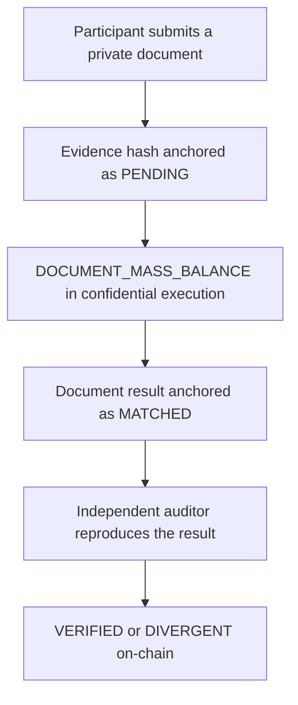
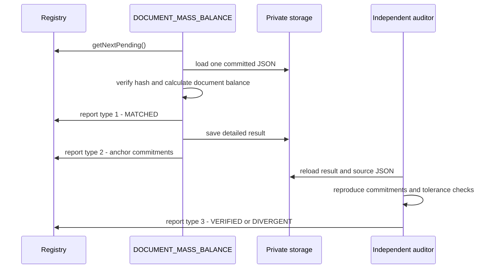

# ExploreChem

Confidential traceability infrastructure for critical-mineral and rare-earth supply chains. ExploreChem combines private operational documents, verifiable actor identities, deterministic mass calculations executed by Chainlink CRE with a confidential TEE handler, independent auditing, and minimal anchoring on Ethereum Sepolia.

> ExploreChem is being developed for ETHOnline 2026. Company names, lot identifiers, document references, quantities, and results shown in the demonstration are fictional.

- Live demo: [armanfm.github.io/ExplorerChem](https://armanfm.github.io/ExplorerChem/)
- Network: Ethereum Sepolia (chain ID `11155111`)
- Contract: [`0xae2FdfcC9584442616fDa974b0a3C101806ff7D5`](https://sepolia.etherscan.io/address/0xae2FdfcC9584442616fDa974b0a3C101806ff7D5)
- License: Apache-2.0

## Overview

ExploreChem separates public proof from private business data.

The blockchain stores actor identities, evidence commitments, workflow authorization, status transitions, and compact result commitments. Original documents, participant names, operational metadata, masses, grades, and detailed calculation output remain private.

The current primary workflow, `DOCUMENT_MASS_BALANCE`, processes one committed document at a time. It verifies the original JSON against its on-chain hash, reads supported mass fields, calculates a document-scoped balance, stores the detailed result privately, and anchors deterministic commitments on Sepolia. It does not search for or compare a predecessor document.

A separate workflow, `PAIRWISE_MASS_AUDITOR`, independently retrieves the anchored result, reconstructs its commitments, repeats supported calculations, applies the configured tolerance where comparable mass values exist, and writes the final audit state on-chain.



The CRE simulator used in the demonstration is not a real TEE. The workflow is configured with `handlerInTee`, but simulator logs are visible for debugging and must not contain production secrets.

## Why ExploreChem

Critical-mineral supply chains involve independent organizations, confidential documents, changing custody, and claims that must remain auditable over time. A conventional shared database forces participants to trust one operator and can expose sensitive data. Publishing complete operational documents on a public blockchain is also inappropriate.

ExploreChem uses a hybrid model:

- private source documents remain in controlled storage;
- the exact file hash is committed on-chain at submission;
- actor and workflow permissions are enforced by the registry;
- the primary CRE workflow verifies and calculates from the committed document;
- a separate auditor independently reproduces the anchored result;
- only deterministic hashes, identifiers, statuses, timestamps, and transaction evidence become public.

## Current MVP scope

The current implementation includes:

- actor registration and actor-owned evidence;
- multiple authorized wallets per actor;
- private evidence storage with an on-chain file commitment;
- blockchain-first discovery of evidence in `PENDING` state;
- verification of the original JSON against its committed hash;
- one document-scoped mass calculation per evidence;
- MUF-style arithmetic using supported input, output, scrap, inventory, and other-output fields;
- carrier custody comparison using collected and delivered mass;
- deterministic integer arithmetic in milligrams;
- limited elemental calculations for supported neodymium fields;
- deterministic result and input commitments;
- a private, append-only detailed result artifact;
- separate primary and auditor workflows;
- independent reconstruction of commitments by the auditor;
- a provisional 2% mass tolerance in the auditor;
- immutable result history and contract support for revisions;
- a client dashboard that combines permitted private data with direct Sepolia reads.

The current implementation does **not** claim:

- direct-predecessor discovery or strict cross-actor document correlation;
- proof of a physical handoff between two independently submitted documents;
- a complete actor-wide or monthly inventory reconciliation;
- native aggregation of multiple input streams into multiple output streams;
- complete elemental conservation for Nd, Pr, Dy, Tb, and every material stream;
- conversion of mass and grade into elemental mass for every stream;
- validation of declared process yield;
- element-specific tolerance policies based on validated measurement uncertainty;
- separate `hash(inputs)` and `hash(outputs)` commitments;
- a Merkle-root implementation for `aggregateInputHash`;
- automatic regulatory certification;
- production validation of confidential execution and every integration path.

Those controls are planned as separate, versioned workflows. They must publish independent commitments and states without changing the meaning or history of the current document calculation.

## Participants and access model

The demonstration models these roles:

- Miner
- Carrier
- Laboratory
- Refiner or processor
- Manufacturer
- Recycler
- Platform operator
- Read-only client

Each participant has a stable `actorId`. The on-chain actor record is intentionally minimal and includes the information required for identity, authorization, and lifecycle control. An actor may authorize more than one wallet. Evidence submission is accepted only from the actor controller or an authorized wallet. Administrative actor registration and workflow configuration are restricted to the contract owner.

The read-only client view is open in the MVP so the public demonstration can be inspected without a wallet. This is a prototype product decision, not a recommendation for every production deployment.

## Evidence submission

A participant submits one operational JSON document for one actor. The application:

1. validates the selected actor and wallet authorization;
2. hashes the original file bytes locally;
3. stores the original document in private storage;
4. records the private lookup metadata required by the workflow;
5. submits the evidence commitment to Ethereum Sepolia;
6. receives the resulting `evidenceId`;
7. leaves the evidence in `PENDING` until the primary workflow processes it.

The registry does not receive the original file, filename, private storage path, participant display name, lot reference, origin, destination, masses, grades, assay data, or commercial fields.

The document remains independently checkable because its hash can be recalculated later and compared with the immutable `evidenceHash` stored on-chain. Changing the file produces a different hash; corrections therefore require a new evidence submission rather than mutation of the anchored document.

## Public and private data

| Layer | Data |
|---|---|
| Ethereum Sepolia | Actor IDs, controllers, authorized wallets, evidence IDs, evidence hashes, submitter, workflow IDs, states, timestamps, result commitments, revision links, and events |
| Supabase database | Participant display data, evidence-to-file lookup, private storage location, UI metadata, and mirror fields |
| Private storage | Original evidence JSON and detailed workflow result JSON |
| Primary CRE workflow | Hash-verified document, selected mass fields, document balance, elemental calculations, and deterministic commitments |
| Auditor CRE workflow | Anchored result, private result manifest, source-document verification, reconstructed commitments, tolerance checks, and audit verdict |
| Public frontend | Permitted private metadata combined with direct Sepolia state and commitments |

Supabase is not authoritative for evidence state. The registry is the authority for `PENDING`, `MATCHED`, `VERIFIED`, and `DIVERGENT`. Database mirror fields are updated only after the workflow confirms the corresponding on-chain postcondition.

## On-chain state model

### Evidence state

| Value | State | Meaning |
|---:|---|---|
| 0 | `NONE` | Evidence does not exist |
| 1 | `PENDING` | Submitted and awaiting the primary workflow |
| 2 | `MATCHED` | The committed document was verified and its primary result was anchored; independent audit is pending |
| 3 | `VERIFIED` | The auditor reproduced the applicable commitments and checks without finding a divergence |
| 4 | `DIVERGENT` | The auditor found an integrity, reconstruction, calculation, or applicable-tolerance divergence |

`MATCHED` does not mean that two actors or two documents were physically correlated. In the current workflow it means that one on-chain evidence commitment was successfully connected to its hash-verified private document and primary result.

### Mass status

The primary workflow deliberately records the document mass status as `NAO_ATESTADO`. It calculates and commits the available values, but it does not issue the final audit verdict.

This is why a carrier document containing 900 kg collected and 897 kg delivered can produce:

- `deltaMg = 3000000`;
- primary mass status `NAO_ATESTADO`;
- evidence state `MATCHED` after the primary workflow;
- evidence state `VERIFIED` after an auditor reproduces the commitments and confirms that the 3 kg difference is within the configured 2% tolerance.

`VERIFIED` therefore describes the auditor's integrity and policy decision. It does not rewrite the primary result's `NAO_ATESTADO` field into `CONFORME`.

## Primary workflow: DOCUMENT_MASS_BALANCE

### 1. Blockchain-first discovery

The workflow asks the registry for the next `PENDING` evidence. The chain determines whether an item can be processed. A recovery path may resume an evidence already in `MATCHED` only when the registry confirms that no balance result has yet been anchored.

### 2. Evidence verification

For the selected `evidenceId`, the workflow:

- reads the on-chain evidence record;
- confirms the expected on-chain state;
- performs a point lookup for the private file;
- downloads the original JSON;
- recalculates the configured SHA-256 or Keccak-256 file hash;
- compares it with the on-chain `evidenceHash`;
- confirms that the document actor matches the on-chain `actorId`.

A hash mismatch stops processing before `MATCHED` or any balance commitment is written.

### 3. Document-scoped calculation

The workflow processes only the selected, hash-verified document:

- `evidenceIds` contains only the selected `evidenceId`;
- `fromEvidenceId` and `toEvidenceId` both identify that evidence;
- `fromActorId` and `toActorId` both identify its actor;
- `relationType` is `DOCUMENT_MASS_BALANCE`;
- `correlationEdges` is empty;
- no predecessor is queried;
- lot, origin, and destination are descriptive metadata, not calculation gates.

### 4. MUF-style mass arithmetic

For non-carrier documents, the intended equation is:

```text
MUF = input + opening inventory
    - product output
    - scrap output
    - other outputs
    - closing inventory
```

Opening inventory, closing inventory, scrap, and other outputs are optional. When an optional field is absent, the calculation falls back to the supported fields that are present. When a field is supplied but cannot be parsed as a valid mass, the corresponding operand remains unknown.

Carrier evidence follows a custody calculation:

```text
difference = collected mass - delivered mass
```

Laboratory documents do not produce a physical mass pair in this workflow. They may still produce supported elemental calculations.

Decimal kilograms are converted deterministically to integer milligrams. Committed arithmetic does not use binary floating-point values.

### 5. Supported fields

The workflow searches documented field paths rather than inferring values from company names or descriptive text.

| Component | Supported examples |
|---|---|
| Input | `transformation.inputMassKg`, `transformation.inputProductMassKg`, `recovery.inputMassKg`, `inputMassKg`, `massBalance.inputMassKg` |
| Product output | `transformation.outputMassKg`, `transformation.outputProductMassKg`, `transformation.finishedProductMassKg`, `recovery.recoveredProductMassKg`, `outputMassKg`, `recoveredMassKg`, `massBalance.outputMassKg` |
| Scrap | `transformation.scrapMassKg`, `massBalance.scrapMassKg`, `scrapMassKg` |
| Opening inventory | `massBalance.openingInventoryMassKg`, `transformation.openingInventoryMassKg`, `openingInventoryMassKg` |
| Closing inventory | `massBalance.closingInventoryMassKg`, `transformation.closingInventoryMassKg`, `closingInventoryMassKg` |
| Other outputs | `massBalance.otherOutputMassKg`, `massBalance.otherOutputsMassKg`, `transformation.otherOutputMassKg`, `transformation.otherOutputsMassKg`, `otherOutputMassKg`, `otherOutputsMassKg` |
| Carrier collected mass | `custody.massCollectedKg`, `collectedMassKg`, `inputMassKg` |
| Carrier delivered mass | `custody.massDeliveredKg`, `deliveredMassKg`, `outputMassKg` |

### 6. Elemental calculations

The producer retains limited neodymium calculations where supported fields exist. Current output can include conversion of Nd2O3 mass and grade into elemental Nd, or a declared elemental partition. This is partial calculation coverage and is not a complete proof of elemental conservation across every input and output stream.

## Deterministic commitments

The primary workflow canonicalizes structured JSON with stable key ordering and hashes the exact canonical representation. Runtime timestamps and random salts are excluded from the commitment.

The result includes:

- `relationFingerprint`;
- `canonicalResultHash`;
- `resultHash`;
- `resultId`;
- `aggregateInputHash`.

`canonicalResultHash` and `resultHash` refer to the same deterministic result commitment in the current implementation. `aggregateInputHash` commits to the source evidence hash and calculation scope. It is a deterministic hash, not a Merkle root, and it is not equivalent to separate input and output commitments.

The v2 result and private manifest schemas are:

- `ExploreChem/DocumentMassResult/v2`;
- `ExploreChem/PrivateDocumentMass/v2`;
- `ExploreChem/DocumentMassInput/v2` for the input commitment domain.

For deployed ABI compatibility, some internal commitment domain strings still retain historical `PairwiseMass` names. Those strings are domain separators only. They do not mean that the current v2 workflow queries a predecessor or performs cross-document correlation.

The absence of a salt makes the result reproducible from the same canonical calculation. It also means the hash alone is not intended to conceal a small, guessable input space. Confidentiality depends on access controls around the original documents and detailed private results.

## Private result artifact

The detailed result is stored outside the chain at:

```text
mass-results/{focusEvidenceId}/{resultId}.json
```

The private artifact uses `ExploreChem/PrivateDocumentMass/v2` and can contain the source evidence commitment, selected mass fields, document mass pair, elemental calculations, deterministic commitments, private path, and transaction references. The blockchain receives only the compact fixed-width report fields required by the registry.

The result table is append-only. Existing records are not updated through an upsert; a later revision must be a new immutable result linked to the previous result.

## Reports sent to the registry

The workflows send fixed-width reports through the authorized Chainlink forwarder.

### Report type 1 — primary processing

This report moves the evidence from `PENDING` to `MATCHED` and records the deterministic fingerprint associated with the processed evidence.

```text
reportType
evidenceId
relationFingerprint
```

The report name and ABI originate from the earlier registry design. In the current v2 workflow, this transition represents successful verification and primary processing of one document, not acceptance of a cross-document handoff.

### Report type 2 — balance result

This report anchors the result for the exact evidence and actor.

```text
reportType
evidenceId
resultId
actorId
resultHash
previousResultId
aggregateInputHash
balanceStatus
calculationVersion
```

The current primary workflow creates the first revision with a zero `previousResultId` and `calculationVersion = 1`.

### Report type 3 — audit outcome

The independent auditor uses this report to move evidence from `MATCHED` to `VERIFIED` or `DIVERGENT`. The primary document workflow does not issue the final audit verdict.

## Processing sequence



The primary workflow sends the state transition before the balance report because the deployed registry accepts a balance for evidence in `MATCHED` or `VERIFIED` state. After each write, the workflow reads the registry again and requires the expected on-chain postcondition before updating private mirror fields.

## Independent auditor

`PAIRWISE_MASS_AUDITOR` is the current implementation name of the separate audit workflow. Despite that retained name, it supports `ExploreChem/PrivateDocumentMass/v2` results and independently repeats the single-document checks.

The auditor:

- discovers evidence already in `MATCHED` state;
- retrieves its anchored balance result;
- downloads the private result manifest and committed source JSON;
- verifies source document hashes again;
- reconstructs `resultHash`, `resultId`, and `aggregateInputHash`;
- compares reconstructed commitments with the private manifest and on-chain result;
- recalculates available document mass values;
- applies the configured tolerance to comparable mass values;
- sends report type 3;
- preserves the primary result and all prior history;
- changes the evidence state on-chain without using a Supabase state patch as authority.

The demonstration uses a provisional tolerance of 200 basis points, equal to 2% of the left or outgoing reference mass:

```text
absolute(delta) * 10000 <= reference mass * 200
```

This tolerance is **arbitrated for the MVP**. It is not a validated industrial uncertainty budget and must not be presented as regulatory certification.

The auditor can issue `DIVERGENT` for a commitment mismatch, an invalid reconstruction, an applicable mass difference outside tolerance, or another supported integrity failure. Missing operands remain `NAO_ATESTADO`; absence of a comparable value is not itself proof of physical loss.

`VERIFIED` means that the implemented checks passed for the committed inputs. It does not prove that the original physical measurements or declarations were truthful.

## History and immutability

ExploreChem does not overwrite on-chain evidence or earlier result commitments.

A future result revision must create:

- a new `resultId`;
- the same evidence and actor scope;
- a `previousResultId` pointing to the prior result;
- a higher `calculationVersion`;
- new input and result commitments;
- its own timestamp.

The registry may update a latest-result pointer while keeping every previous result addressable. The current primary workflow writes only the initial revision.

## Frontend

The frontend supports the demonstrated lifecycle:

- wallet connection;
- actor selection and identity display;
- evidence upload;
- local file hashing;
- private document storage;
- on-chain evidence registration;
- transaction and evidence inspection;
- actor-scoped client balance views;
- download of authorized source documents and detailed result artifacts;
- local reconstruction checks against public commitments;
- direct display of Sepolia state and events.

Participant names, filenames, storage paths, lots, and calculation details come from permitted private application data. Actor IDs, evidence IDs, evidence hashes, authorized wallets, states, timestamps, workflow IDs, transaction hashes, and result commitments can be checked against Ethereum Sepolia.

## Security and trust boundaries

The MVP implements these controls:

- original documents are not written to the public chain;
- evidence hashes bind later inspection to the submitted bytes;
- private database fields are lookup metadata, not proof;
- document identity, ownership, and hash are rechecked during processing;
- the registry is authoritative for evidence state;
- only configured workflow IDs through the authorized forwarder can apply reports;
- committed mass arithmetic uses integers;
- result commitments are deterministic, canonicalized, and domain-separated;
- the auditor reconstructs commitments instead of trusting stored output;
- prior evidence and result history remains immutable.

Accepted prototype limitations:

- the registry owner is a single externally owned account;
- the owner can replace the forwarder and expected workflow identifiers;
- primary and auditor separation depends on correct contract configuration;
- anchored evidence cannot currently be revoked;
- `DIVERGENT` is terminal in the current state machine;
- private storage and database access policies require production hardening;
- the CRE simulator is not a production TEE;
- the project has not undergone an independent production security audit.

Production use also requires multisignature or governed administration, independent contract review, access-policy review, secret rotation, monitoring, incident response, schema governance, measurement-policy validation, and end-to-end testing in real confidential execution.

## Coverage and planned specialized workflows

| Capability | Current status |
|---|---|
| Verify the original JSON hash | Implemented |
| Calculate input + opening inventory - outputs - closing inventory | Implemented for supported fields in one document |
| Keep operational masses off-chain | Implemented |
| Anchor result commitments on-chain | Implemented |
| Independently reproduce result commitments | Implemented |
| Apply a general 2% tolerance | Implemented in the auditor as an MVP policy |
| Multiple inputs and multiple outputs | Planned specialized workflow |
| Complete conservation by Nd, Pr, Dy, Tb, and other elements | Partial for Nd; broader workflow planned |
| Mass x grade conversion for every stream | Planned specialized workflow |
| Declared-yield validation | Planned specialized workflow |
| Element-specific uncertainty tolerances | Planned specialized workflow |
| Separate input and output hashes | Planned |
| Merkle root over calculation inputs | Planned |
| Prove N-input to M-output transformation | Planned specialized workflow |

The target architecture allows the same immutable evidence to be evaluated by multiple authorized workflows. Each specialized workflow should have its own versioned schema, calculation domain, commitment, and independent status. A future evidence lifecycle may therefore expose separate states such as document integrity verified, MUF checked, tolerance checked, elemental conservation checked, yield checked, and multi-stream transformation checked instead of collapsing every decision into one generic `VERIFIED` label.

These future states and workflows are architectural evolution, not claims about the current deployed MVP.

## Running the workflows

From the directory that contains each initialized workflow folder:

```bash
cre workflow simulate ./massa-worflow --broadcast
cre workflow simulate ./auditor-workflow --broadcast
```

On Windows Command Prompt, the equivalent commands are:

```bat
cre workflow simulate .\massa-worflow --broadcast
cre workflow simulate .\auditor-workflow --broadcast
```

`--broadcast` instructs the simulator to transmit generated reports to the configured network. A primary result can include `matchTxHash` and `resultTxHash`; an auditor result includes the audit transaction when it changes the evidence state.

If a command reports that `workflow.yaml` is missing, the supplied path is not the initialized workflow directory. Do not run the command from the parent directory with `.` unless that directory itself contains `workflow.yaml`.

Environment-specific workflow IDs, forwarder address, storage bucket, Supabase configuration, and secret identifiers belong in the active workflow configuration and must not be copied from this README.

## Deployment

| Item | Value |
|---|---|
| Network | Ethereum Sepolia |
| Chain ID | `11155111` |
| Registry used by the current frontend and workflows | `0xae2FdfcC9584442616fDa974b0a3C101806ff7D5` |
| Contract explorer | [View on Sepolia Etherscan](https://sepolia.etherscan.io/address/0xae2FdfcC9584442616fDa974b0a3C101806ff7D5) |
| Frontend | [ExploreChem live demo](https://armanfm.github.io/ExplorerChem/) |

## Design decisions

### Why the current calculation uses one document

The current workflow can process the first evidence submitted by an actor without depending on a counterparty having already submitted a predecessor. This provides immediate document-integrity verification and a reproducible primary mass calculation.

The trade-off is explicit: it verifies the internal calculation derived from one committed declaration; it does not prove consistency between independent actors. A document can be hash-valid and internally coherent while containing an untruthful original declaration. External data, independent source documents, measurement controls, and specialized auditors are required to address that risk.

### Why primary calculation and audit are separate

The primary workflow produces a reproducible result without assigning its own final audit verdict. The auditor then reconstructs the commitments and applies its policy independently. This lets future auditors evaluate different properties of the same evidence without changing the original result.

### Why the current result remains NAO_ATESTADO

`NAO_ATESTADO` distinguishes a producer calculation from an independent audit conclusion. The available operands and difference are still stored and committed. The auditor uses those values to decide whether the evidence becomes `VERIFIED` or `DIVERGENT` under its configured policy.

### Why there is no random salt

The commitment must be reproducible from the same canonical input. Actor ID, evidence ID, calculation version, domain, and canonical content provide deterministic separation. A salt would introduce extra secret state without being required for result identity.

## Roadmap

Planned work includes:

- rename remaining historical `PairwiseMass` implementation identifiers in a versioned migration;
- add deterministic test vectors for canonicalization and report encoding;
- add workflow-specific automated tests for the primary and auditor implementations;
- validate producer and auditor compatibility end-to-end;
- formalize versioned input schemas for every participant document type;
- implement multi-input and multi-output stream aggregation;
- add complete element-specific conversion and conservation checks;
- validate declared process yield;
- add separate input and output commitments and evaluate a Merkle commitment model;
- replace the provisional 2% policy with documented tolerances based on measurement requirements;
- introduce independent, workflow-specific audit statuses;
- complete security review, production TEE validation, and operational monitoring.

## Use of AI tools

Claude, ChatGPT, and Manus were used during development for code generation and modification, implementation review, debugging, research, interface work, synthetic demonstration data, and documentation.

AI assistance covered:

- **Primary CRE workflow (`DOCUMENT_MASS_BALANCE`):** evidence selection, private JSON retrieval, hash verification, mass and limited elemental calculations, canonicalization, result persistence, report generation, and debugging;
- **Auditor CRE workflow (`PAIRWISE_MASS_AUDITOR`):** reconstruction of commitments, source-document verification, tolerance checks, audit outcome reporting, and debugging;
- **Frontend (`index.html`):** interface design and implementation changes for evidence submission, actor navigation, and result presentation; Manus contributed design assistance;
- **Smart contract and tests:** review, test preparation, debugging, and English NatSpec documentation;
- **Documentation and fictional demonstration inputs:** drafting, revision, limitation disclosure, and synthetic JSON generation.

The human team defined the problem, product scope, architecture, requirements, and integration approach. Armando Freire directed the technical work, evaluated and revised proposed implementations, configured and deployed contracts and workflows, ran tests and simulations, and investigated failures. Jéssica directed product framing, requirements, user experience, business validation, and presentation. Final decisions and responsibility remain with the team.

AI-generated output is not treated as proof of correctness or as an independent security audit. Successful demonstrations establish only the behavior actually exercised. Historical demonstration records can contain deliberate negative tests or outcomes produced during development and must not be represented as real industrial discrepancies.

## Team

- **Armando Freire — Technical Lead:** architecture, smart contracts, Chainlink CRE/TEE workflows, backend and blockchain integration, security planning, testing, and technical documentation.
- **Jéssica — Product Lead:** problem framing, requirements, user experience, business validation, communication, and presentation.

## License

Apache License 2.0. See [LICENSE](./LICENSE).

