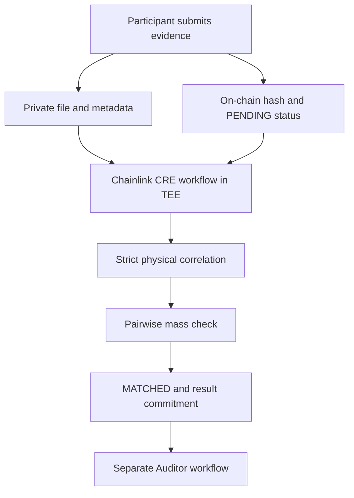
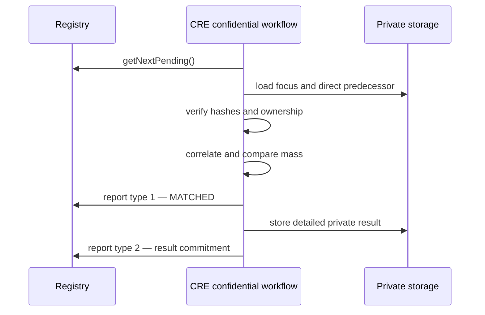

# ExploreChem

Confidential traceability infrastructure for critical-mineral and rare-earth supply chains. ExploreChem combines private operational documents, verifiable actor identities, strict chain-of-custody correlation, pairwise mass checking by a Chainlink CRE workflow configured for confidential TEE execution, and minimal anchoring on Ethereum Sepolia.

> ExploreChem is being developed for ETHOnline 2026. Company names, lot identifiers, document references, quantities, and results shown in the demonstration are fictional.

- Live demo: [armanfm.github.io/ExplorerChem](https://armanfm.github.io/ExplorerChem/)

- Network: Ethereum Sepolia (chain ID `11155111`)

- Contract: [`0xcd5eDA10c0b3424999626e6A2DaB2909B982866c`](https://sepolia.etherscan.io/address/0xcd5eDA10c0b3424999626e6A2DaB2909B982866c)

- License: Apache-2.0

## Overview

ExploreChem separates public proof from private business data.

The blockchain stores identities, evidence commitments, workflow authorization, status transitions, and compact result commitments. Original files, participant names, operational metadata, and detailed calculation output remain private. A Chainlink CRE workflow configured with a confidential handler opens and verifies the committed files, correlates physically connected evidence, checks the mass declared at a handoff, and publishes only the minimum report required by the contract.



The current mass workflow performs a local pairwise comparison between the selected evidence and its direct predecessor. Where supported source fields are present, it also emits elemental calculations. This is not a global inventory balance, a monthly material-unaccounted-for calculation, or a complete verification of elemental conservation. The demonstrated confidential execution uses the CRE simulator, which is not a real TEE.

## Why ExploreChem

Critical-mineral supply chains involve multiple independent organizations, confidential documents, changing custody, and claims that must remain auditable over time. A conventional shared database forces participants to trust one operator and may expose sensitive data. Publishing every document on-chain is also impractical and inappropriate.

ExploreChem uses a hybrid model:

- private source documents remain under controlled storage;

- the document hash is committed on-chain at submission;

- actor and workflow identities are checked on-chain;

- the CRE workflow independently downloads and verifies the committed documents;

- correlation and mass comparison run in confidential execution;

- only deterministic hashes, statuses, timestamps, and transaction evidence become public.

## Current MVP scope

The current implementation includes:

- actor registration and actor-owned evidence;

- multiple authorized wallets per actor;

- private evidence storage with an on-chain file commitment;

- on-chain evidence states;

- blockchain-first discovery of pending evidence;

- same-lot candidate discovery through a private index;

- strict origin/destination correlation;

- selection of the direct predecessor for the current evidence;

- pairwise comparison of the predecessor's outgoing mass with the current evidence's incoming mass;

- deterministic, unsalted result commitments;

- separate match and balance reports sent through the Chainlink forwarder;

- a hybrid inspection page that cross-checks private files against Sepolia;

- a separate auditor for already matched evidence and contract support for result revisions;
- a provisional auditor tolerance of 2% of outgoing mass;
- elemental calculation output where supported inputs are available.

The following items are not claimed as completed by this workflow:

- periodic or monthly actor-wide reconciliation;

- inventory opening and closing balance;

- complete elemental conservation coverage for every actor and material;

- measurement-uncertainty-based acceptance limits validated with field data;

- moisture-basis normalization;

- automatic compliance certification;

- production validation of confidential execution and all integration paths.

Those controls can be added as later, versioned workflows without changing the meaning of the current pairwise result.

## Participants and access model

The demonstration models the following roles:

- Miner

- Carrier

- Laboratory

- Refiner or processor

- Manufacturer

- Recycler

- Platform operator

- Read-only client

Each supply-chain participant has a stable `actorId`. The on-chain actor record is intentionally minimal and can include:

- `actorId`;

- `actorType`;

- `metadataHash`;

- controller address;

- active or inactive state;

- creation timestamp.

An actor may authorize more than one wallet. Evidence submission is accepted only from the actor controller or an authorized wallet. Actor registration and administrative workflow configuration are restricted to the contract owner.

The read-only client view is open in the MVP so the public demonstration can be inspected without a wallet. This is a product choice for the prototype, not a recommendation for every production deployment.

## Evidence submission

A participant submits an operational document for one actor. The application:

1. validates the selected actor and wallet authorization;

2. calculates the configured hash of the original file;

3. stores the original document in private storage;

4. stores the private indexing metadata required by the workflow;

5. submits the evidence commitment to Ethereum Sepolia;

6. receives the resulting `evidenceId`;

7. leaves the evidence in `PENDING` until an authorized workflow processes it.

The contract does not receive the original file, participant name, filename, private storage path, lot number, origin, destination, masses, assay data, or commercial fields.

A file remains independently verifiable because its hash can be recalculated later and compared with the immutable `evidenceHash` committed on-chain.

## Public and private data

| Layer | Data |
|---|---|
| Ethereum Sepolia | Actor identifiers, controllers, authorized wallets, evidence identifiers, file commitments, submitter address, workflow IDs, statuses, timestamps, result commitments, revision links, and events |
| Supabase database | Participant display data, evidence-to-file index, private storage path, lot lookup index, and simulation mirror fields |
| Private Storage | Original evidence JSON documents and detailed workflow result JSON |
| Chainlink CRE workflow in TEE | Downloaded documents, verified contents, correlation graph, selected mass fields, pairwise calculation, and canonicalization |
| Public frontend | A combined inspection view built from permitted private metadata and direct Sepolia reads |

Supabase is not the authority for the evidence status. The contract state is authoritative. In simulator mode, a Supabase mirror can be used only as a progress cursor when the simulated chain does not advance as a live deployment would; the candidate still has to be `PENDING` on-chain.

## On-chain state model

### Evidence status

The contract defines:

| Value | Status | Meaning |
|---:|---|---|
| 0 | `NONE` | Evidence does not exist |
| 1 | `PENDING` | Submitted and awaiting correlation |
| 2 | `MATCHED` | Correlation was accepted by the authorized workflow |
| 3 | `VERIFIED` | A separate audit workflow accepted the evidence |
| 4 | `DIVERGENT` | A separate audit workflow found a divergence |

The current pairwise workflow ends at `MATCHED`. It does not assign `VERIFIED` or `DIVERGENT`. Those final audit transitions are applied by the separate `PAIRWISE_MASS_AUDITOR` workflow.

### Pairwise mass status

The result also carries an independent mass status:

| Value | Status | Meaning |
|---:|---|---|
| 0 | `NONE` | No result |
| 1 | `CONFORME` | Both mass values exist and the signed difference is zero |
| 2 | `DIVERGENTE` | Both values exist and the signed difference is nonzero |
| 3 | `NAO_ATESTADO` | A physical relation exists, but one or both required masses are absent |

Evidence status and mass status answer different questions. `MATCHED` confirms that the documents form an accepted relation. `CONFORME`, `DIVERGENTE`, or `NAO_ATESTADO` describes the mass comparison for that relation.

## Current CRE/TEE workflow

The implemented workflow is named `LOT_CHAIN_PAIRWISE_MASS`.

### 1. Blockchain-first discovery

The workflow calls the registry for the next pending evidence. The chain is the authority for whether an item can be processed.

### 2. Focus evidence verification

For the selected `evidenceId`, the workflow:

- reads the on-chain evidence record;

- confirms `PENDING`;

- locates the private file through the private index;

- downloads the original JSON document;

- recalculates its SHA-256 or Keccak-256 hash, according to the evidence configuration;

- rejects the document if the recalculated hash differs from the on-chain `evidenceHash`;

- confirms that the document owner matches the on-chain `actorId`.

### 3. Candidate discovery

Supabase locates the selected evidence file and its direct predecessor. The current workflow does not build a balance from all evidence sharing a lot reference. The documents used in the comparison are checked against their respective on-chain commitments.

The indexed lot value is a lookup optimization, not proof. The committed documents provide the inputs for the comparison; the index alone does not establish document integrity.

### 4. Strict physical correlation

Two documents form a directed physical handoff only when all three conditions hold:

```text

from.lotId == to.lotId

from.destinationActorId == to.ownerActorId

to.originActorId == from.ownerActorId

```

This prevents same-lot documents from being connected merely because they share a label. Correlation does not use mass values, company names, approximate text, timestamps, or inferred commercial relationships.

The current processing scope is the focus evidence and its direct predecessor, not a breadth-first reconstruction of the full lot. Actor roles determine which mass fields are used; they do not impose a fixed order of companies.

### 5. Origin-focused pairwise mass check

The result belongs to the current focus evidence and its actor. The predecessor declares the outgoing mass, and the current actor declares the received mass. The workflow compares those two values and anchors the result for the current evidence.

The predecessor is the preceding evidence in the relevant physical handoff, not simply the most recently uploaded document. Processing a later evidence produces its own result; it does not sum the entire chain or replace earlier commitments.

### 6. Mass field selection

For an outgoing declaration, the workflow uses the actor-specific field and, where implemented, a documented fallback:

| Actor role | Outgoing mass |
|---|---|
| Miner | `outputMassKg`, falling back to `massBalance.grossMassKg` |
| Carrier | Delivered mass |
| Refiner or processor | Output mass |
| Manufacturer | Scrap mass when the destination is a recycler; otherwise output mass |
| Recycler | Recovered mass |
| Laboratory | No physical outgoing mass for this workflow |

For an incoming declaration:

| Actor role | Incoming mass |
|---|---|
| Carrier | Collected mass |
| Refiner or processor | Input mass |
| Manufacturer | Input mass |
| Recycler | Input mass |
| Laboratory | No physical incoming mass for this workflow |

The selected decimal kilogram values are converted to integer milligrams. Conversion uses deterministic half-up rounding after six decimal places, avoiding floating-point ambiguity in the commitment.

For each pair:

```text

deltaMg = leftMassMg - rightMassMg

```

The delta is signed:

- `0` → `CONFORME`;

- nonzero → `DIVERGENTE`;

- missing side → `NAO_ATESTADO`.

There is no global sum across all companies in the current workflow.

## Deterministic result commitments

The workflow canonicalizes structured JSON with stable key ordering and hashes the exact canonical form. It does not use a random salt or a runtime timestamp in the commitment.

Domain separation and explicit versioning prevent the same bytes from being interpreted as another kind of result. Current domains include:

- `ExploreChem/PairwiseMassPair/v1`

- `ExploreChem/PairwiseMassRelation/v1`

- `ExploreChem/PairwiseMassInput/v1`

- `ExploreChem/PairwiseMass/v1`

- `ExploreChem/PairwiseMassResultId/v1`

The canonical result includes the domain, actor, focus evidence, calculation version, verified relation fingerprint, input commitment, mass status, and canonical pair output. Its deterministic hash is the `canonicalResultHash` and is also used as the contract's `resultHash`.

Conceptually:

```json

{

  "domain": "ExploreChem/PairwiseMass/v1",

  "actorId": "0x…",

  "focusEvidenceId": "0x…",

  "calculationVersion": 1,

  "result": {

    "massStatus": "CONFORME",

    "pairs": []

  }

}

```

The absence of a salt makes the same canonical calculation reproducible. It also means the hash is not intended to hide a very small, guessable input space by itself. Confidentiality still depends on keeping the underlying operational documents and detailed result private.

## Private result artifact

The detailed result is stored outside the chain under a deterministic private path:

```text

mass-results/{focusEvidenceId}/{resultId}.json

```

The private artifact can contain the verified evidence set, correlation edges, mass pairs, selected source fields, signed deltas, status, and commitments. The chain receives only the compact fields needed for public anchoring.

## Reports sent to the contract

The registry receives fixed-width reports through the authorized Chainlink forwarder.

### Report type 1 — evidence correlation

This report marks the focus evidence as `MATCHED` and records the relation fingerprint.

```text

reportType

evidenceId

relationFingerprint

```

### Report type 2 — pairwise balance result

This report stores the result for the same focus evidence and actor.

```text

reportType

resultId

evidenceId

actorId

resultHash

previousResultId

aggregateInputHash

status

calculationVersion

```

The `evidenceId` is not zero in the current workflow. The result is evidence-scoped and actor-scoped.

The current workflow creates the first result revision with `previousResultId = 0x00…00` and `calculationVersion = 1`. The contract already supports later revisions for the same evidence and actor, requiring a valid previous result and an incremented calculation version. Automatic periodic revision creation is not yet part of this workflow.

### Report type 3 — audit outcome

The contract supports a separate audit report that can move `MATCHED` evidence to `VERIFIED` or `DIVERGENT`. That report belongs to the separate `PAIRWISE_MASS_AUDITOR` workflow and is not emitted by `LOT_CHAIN_PAIRWISE_MASS`.

## Processing sequence



The match report is sent before the balance report because the contract accepts a balance for evidence in `MATCHED` or `VERIFIED` state.

## Auditor separation

The audit step is intentionally separate from correlation and pairwise mass checking.

The separate `PAIRWISE_MASS_AUDITOR` workflow is implemented and has been exercised in simulation. It is responsible for:

- read evidence already in `MATCHED`;

- retrieve the anchored result and reproduce its commitment from the private result JSON;
- independently verify the current and predecessor documents used in the comparison;
- recalculate the pairwise difference and apply a provisional 2% tolerance referenced to outgoing mass;

- issue report type 3;

- preserve the existing match and balance history;

- move the evidence to `VERIFIED` or `DIVERGENT`.

This separation keeps `MATCHED` as a statement about correlation and reserves `VERIFIED` or `DIVERGENT` for the independent audit decision. The 2% tolerance is **[ARBITRATED]**, not a validated measurement-uncertainty budget. It applies to the pairwise mass check and must not be presented as proof of global elemental conservation. A producer result containing `elementalCalculations` does not by itself prove that the deployed auditor validates those calculations; producer and auditor versions must agree on the committed fields and supported checks.

Audit divergence can identify a reproduced mass difference outside the applicable tolerance, an integrity mismatch, an inconsistent calculation, or an unsupported result scope. A missing document associated with an on-chain result must be reported explicitly as missing supporting evidence; it is not proof of a physical mass loss. The implementation's error handling determines whether an individual failure produces a verdict or stops execution.

**Demonstration history:** visible `DIVERGENT` records may include intentionally inconsistent test data and results caused by earlier implementation bugs or version incompatibilities, including scope rejection and commitment reconstruction errors. They must not be represented as real industrial discrepancies. Existing on-chain history is preserved. `VERIFIED` means the implemented checks passed for the audited inputs; it does not establish that the original physical measurements were truthful.

A future periodic actor reconciliation may also consume the actor's previous balance and new matched evidence over a defined time window. That is a different calculation domain and must create a new immutable result linked to the previous result; it must not overwrite historical commitments.

## History and immutability

ExploreChem does not destroy prior on-chain evidence or result records.

A result revision is appended as a new result with:

- a new `resultId`;

- the same evidence and actor scope;

- `previousResultId` pointing to the prior revision;

- a higher `calculationVersion`;

- its own result and input commitments;

- its own creation timestamp.

The latest-result pointer is updated, while old records remain addressable. The current pairwise workflow uses the first revision only; the revision mechanism is available in the contract for later workflows.

## Frontend

The frontend supports the demonstration lifecycle:

- wallet connection;

- actor selection and identity display;

- evidence upload;

- local file hashing;

- private storage submission;

- on-chain evidence registration;

- evidence and transaction inspection;

- DPP-style traceability views;

- hybrid verification of private files against public commitments;

- direct display of Sepolia state and events.

Participant names and filenames shown by the interface come from private application data. Actor IDs, evidence IDs, evidence hashes, authorized wallets, states, timestamps, workflow IDs, and transaction hashes are read from Ethereum Sepolia.

The hybrid inspection page downloads an original file through an authorized signed URL, recalculates its hash locally, and compares it with the on-chain anchor.

## Security and trust boundaries

The MVP is designed around the following controls:

- original documents are not stored on a public chain;

- evidence hashes bind later inspection to the submitted bytes;

- private index fields are treated as discovery hints and revalidated against committed files;

- the chain is authoritative for `PENDING` and workflow transitions;

- only configured workflow IDs and the authorized forwarder can apply CRE reports;

- actor ownership is rechecked between the document and the chain;

- correlation requires strict bidirectional origin/destination consistency;

- integers are used for committed mass arithmetic;

- result hashes are deterministic and domain-separated;

- old result revisions remain immutable.

For production use, deployment operations should also include independent smart-contract review, access-policy review, secret rotation, storage-policy testing, monitoring, incident response, and formal version governance for every calculation domain.

## Repository structure

```text

contracts/

  ExploreChemRegistry.sol

explorerchem-workflow/

  main.ts

  main.test.ts

  config.staging.json

  config.production.json

  workflow.yaml

  package.json

  tsconfig.json

index.html

project.yaml

README.md

```

The exact file list may evolve as the Auditor is moved into its own repository.

## Running the CRE workflow

Install project dependencies in the workflow directory, authenticate the CRE CLI, and use the environment configuration appropriate to the deployment.

Typical simulator command:

```bash

cre workflow simulate massa-worflow --broadcast

```

`--broadcast` is required when the simulation should transmit the generated reports to the configured chain. A successful simulator response can include both `matchTxHash` and `resultTxHash`.

The simulator is not a real TEE and must not be treated as a safe environment for production secrets. Real confidential execution does not expose user logs in the same way as local simulation.

## Deployment

| Item | Value |
|---|---|
| Network | Ethereum Sepolia |
| Chain ID | `11155111` |
| Registry contract | `0xcd5eDA10c0b3424999626e6A2DaB2909B982866c` |
| Contract explorer | [View on Sepolia Etherscan](https://sepolia.etherscan.io/address/0xcd5eDA10c0b3424999626e6A2DaB2909B982866c) |
| Frontend | [ExploreChem live demo](https://armanfm.github.io/ExplorerChem/) |

Workflow IDs, forwarder address, storage bucket, Supabase project settings, and secret identifiers are environment-specific and should be read from the active deployment configuration rather than copied from documentation.

## Design decisions

### Why the document is anchored at the origin

The origin actor supplies the outgoing declaration, and the receiving actor supplies its own incoming declaration. The current implementation anchors the comparison to the selected focus evidence, using its direct predecessor as the counterpart.

This result describes that handoff. It does not certify the entire supply chain or accumulate all previous quantities into a global balance.

### Why correlation is separate from mass conformity

A valid physical relation may still contain divergent mass values, and a missing mass does not erase the relation. Therefore:

- `MATCHED` describes the evidence relationship;

- `CONFORME`, `DIVERGENTE`, or `NAO_ATESTADO` describes its mass check;

- `VERIFIED` or `DIVERGENT` describes a later audit outcome.

### Why there is no random salt

The commitment must be reproducible from the same canonical calculation. Actor ID, focus evidence ID, calculation version, domain, and full canonical content provide identity and separation. A salt would introduce additional secret state without being required for uniqueness.

## Roadmap

Planned work includes:

- publish the separate Auditor CRE/TEE repository;

- validate producer/auditor version compatibility with reproducible end-to-end cases;

- add deterministic test vectors for canonicalization and report encoding;

- expand automated workflow and contract integration tests;

- formalize versioned schemas for each participant document type;

- define a separate periodic actor-reconciliation domain;

- replace the provisional 2% tolerance with an agreed, documented measurement policy;
- extend inventory, time-window, moisture, and elemental conservation checks only where the required source data and business rules are defined;

- complete security review and operational monitoring.

## Use of AI tools

Claude, ChatGPT, and Manus were used during development. AI assistance included code generation and modification, implementation review, debugging, research, interface work, and documentation. Its contribution was not limited to proofreading or suggestions.

AI-assisted work covered the following components:

- **Mass CRE workflow (`LOT_CHAIN_PAIRWISE_MASS`, TypeScript `main.ts`):** generation and modification of code for evidence selection, private JSON retrieval, commitment verification, pairwise mass calculations, elemental calculation output, result serialization, and persistence; assistance diagnosing execution and integration errors.
- **Auditor CRE workflow (`PAIRWISE_MASS_AUDITOR`, TypeScript `main.ts`):** generation and modification of code for auditing anchored results, reproducing commitments, checking source documents and calculations, applying tolerance rules, and reporting audit outcomes. ChatGPT was used directly for changes and debugging in both CRE workflows.
- **Frontend (`index.html`):** AI-assisted interface design and implementation changes, including evidence submission and result presentation. Manus was used for design assistance.
- **Smart-contract development and tests:** assistance with code review, test preparation, debugging, and English NatSpec documentation. Deployment and configuration were performed by the technical lead.
- **Documentation and demonstration data (`README.md` and fictional participant JSON documents):** assistance drafting and revising explanations, documenting limitations, and generating synthetic test inputs.

The human team defined the problem, product scope, architecture, business requirements, and integration approach. Armando Freire directed the technical work, selected and revised proposed implementations, configured and deployed the contracts and workflows, ran tests and simulations, and investigated observed failures. Jéssica directed product framing, requirements, user experience, business validation, and presentation. Final decisions and responsibility remain with the team.

AI-generated output is not treated as proof of correctness or as an independent security audit. Development exposed implementation errors and incompatibilities between versions; successful demonstrations establish only the behavior actually exercised. Historical demonstration results may include deliberate negative tests and outcomes affected by those development issues, rather than discrepancies in real industrial measurements.

This disclosure describes the assistance used in the submitted project. It does not claim that all generated code has been independently audited or that every execution path has been validated.

## Team

- **Armando Freire — Technical Lead:** architecture, smart contracts, Chainlink CRE/TEE workflows, backend and blockchain integration, security planning, testing, and technical documentation.

- **Jéssica — Product Lead:** problem framing, requirements, user experience, business validation, communication, and presentation.

## License

Apache License 2.0. See [LICENSE](./LICENSE).
