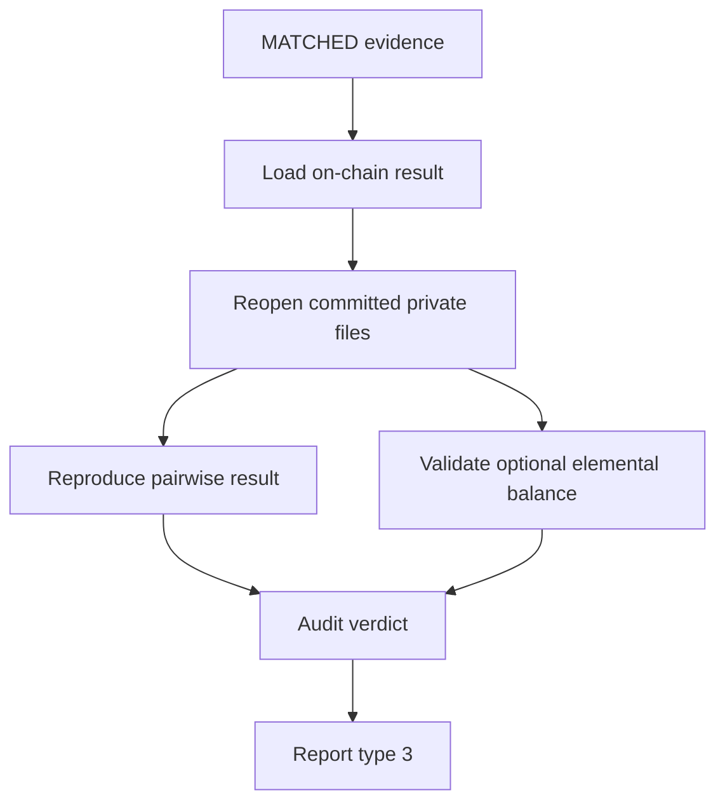
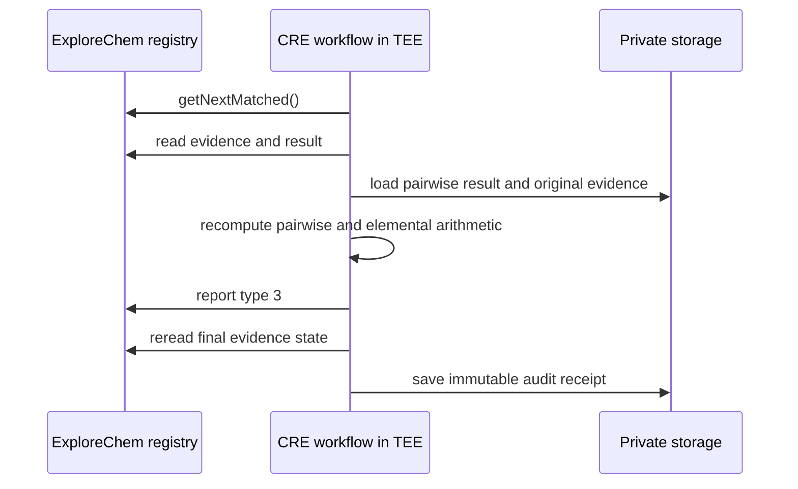

# ExploreChem Auditor Workflow

Independent Chainlink CRE workflow executed inside a TEE for auditing matched ExploreChem evidence, reproducing the pairwise mass result, and validating an optional periodic elemental balance declared by the evidence owner.

This workflow is separate from `LOT_CHAIN_PAIRWISE_MASS`. It does not discover `PENDING` evidence, rebuild the custody graph, or replace the result created by the primary workflow.

- Network: Ethereum Sepolia
- Chain ID: `11155111`
- Registry contract: [`0xcd5eDA10c0b3424999626e6A2DaB2909B982866c`](https://sepolia.etherscan.io/address/0xcd5eDA10c0b3424999626e6A2DaB2909B982866c)
- Current workflow name: `PAIRWISE_MASS_AUDITOR`

## Responsibility

The Auditor starts from evidence already in `MATCHED` state.

It performs two independent checks:

1. mandatory reproduction of the pairwise result created by the primary workflow;
2. validation of `elementalBalance` when that block exists in the committed source document.



The final evidence transition is:

- `VERIFIED` when every required check is reproducible and conforming;
- `DIVERGENT` when integrity, arithmetic, ownership, pairwise status, or a supplied elemental balance fails;
- unchanged `MATCHED` when the evidence does not yet have an on-chain balance result.

## Relationship with the primary workflow

| Concern | Primary pairwise workflow | Auditor workflow |
|---|---|---|
| Discovery | Next `PENDING` evidence | Next `MATCHED` evidence |
| Custody correlation | Yes | No |
| Physical handoff calculation | Creates it | Reproduces it |
| Original document hash | Verifies it | Verifies it again |
| Private result hash | Creates it | Recomputes it |
| Elemental normalization | No | Yes, when `elementalBalance` exists |
| Final evidence state | `MATCHED` | `VERIFIED` or `DIVERGENT` |
| Contract report | Types 1 and 2 | Type 3 |

## Blockchain-first discovery

The Auditor calls `getNextMatched()` on the registry. Supabase is not used to decide which evidence is eligible.

After discovery, it reads:

- `getEvidence(evidenceId)`;
- `latestResultIdByEvidence(evidenceId)`;
- `getResult(resultId)`;
- `verifyResultHash(resultId, candidateHash)`.

The evidence must still be `MATCHED` when processing begins.

## Pairwise result audit

The Auditor retrieves the private result from:

```text
mass-results/{evidenceId}/{resultId}.json
```

It verifies that:

- the private result belongs to the selected evidence;
- the source actor matches the on-chain actor;
- the source evidence hash matches the on-chain commitment;
- the result stored on-chain belongs to the same evidence and actor;
- `aggregateInputHash` is reproducible;
- `canonicalResultHash` is reproducible;
- private `resultHash` equals the canonical hash;
- on-chain `resultHash` equals the recomputed hash;
- `resultId` is reproducible;
- `verifyResultHash` returns `true`;
- every pairwise `deltaMg` is correct;
- every pairwise status is correct;
- the global mass status is correct;
- the on-chain mass status matches the recomputed status.

The pairwise audit succeeds only when the recomputed global result is `CONFORME`.

A `DIVERGENTE` or `NAO_ATESTADO` pairwise result produces an audit verdict of `DIVERGENT`. The custody relation remains historically recorded; the Auditor is judging the result, not deleting the relation.

## Original evidence verification

The Auditor downloads the original evidence JSON using the private `storage_bucket` and `storage_path`.

It recalculates the configured hash:

- SHA-256 for `SHA-256` or `SHA256`;
- Keccak-256 for `KECCAK256` or `KECCAK-256`.

The recalculated file hash, the Supabase index hash, and the on-chain `evidenceHash` must all agree before the document is used.

## Elemental balance block

An evidence document can contain an `elementalBalance` object with schema:

```text
ExploreChem/PeriodicElementalBalance/v1
```

The balance is actor-scoped and period-scoped. It is a declaration produced by the actor and independently recomputed by the Auditor.

The current implementation supports:

- elements `ND`, `PR`, `DY`, and `TB`;
- input, product, waste, purge, effluent, opening inventory, and closing inventory;
- `AS_RECEIVED`, `DRY_105C`, `CALCINED`, and `LIQUID_TOTAL` bases;
- percent content for solid streams;
- milligrams per kilogram for total-liquid streams;
- deterministic oxide-to-element factor table version `1.0.0`;
- integer milligram output;
- half-up rounding only at the final elemental milligram conversion;
- signed MUF by element;
- private product-recovery indicator in parts per million.

### Supported oxide factors

| Element | Reported form | Oxide-to-element factor |
|---|---|---:|
| Nd | `ND2O3` | 0.857356 |
| Pr | `PR6O11` | 0.827704 |
| Pr | `PR2O3` | 0.854472 |
| Dy | `DY2O3` | 0.871321 |
| Tb | `TB4O7` | 0.850215 |
| Tb | `TB2O3` | 0.868806 |
| Nd, Pr, Dy, or Tb | `DIRECT_ELEMENTAL` | 1.000000 |

A form that does not belong to the declared element is rejected.

## Calculation order

The order is mandatory.

### 1. Normalize the stream mass

For an as-received stream:

```text
dryMassKg =
  grossMassKg × (1 − freeMoisturePct / 100)
```

For a dry stream:

```text
dryMassKg = grossMassKg
```

For a calcined stream:

```text
dryMassKg =
  grossMassKg ÷ (1 − lossOnIgnitionPct / 100)
```

A `LIQUID_TOTAL` stream retains its declared total mass.

For `AS_RECEIVED`, the Auditor requires the moisture method, drying temperature, moisture sampling timestamp, and interval between determinations. Drying temperature must be between 100 and 110 °C.

### 2. Calculate contained oxide

For a solid stream:

```text
oxideMassKg =
  dryMassKg × reportedContentPct / 100
```

### 3. Convert oxide to element

```text
elementMassKg =
  oxideMassKg × oxideToElementFactor
```

For `DIRECT_ELEMENTAL`, the factor is 1.

For a `LIQUID_TOTAL` stream:

```text
elementMassMg =
  totalMassKg × concentrationMgPerKg
```

### 4. Convert to canonical integer milligrams

```text
elementMassMg =
  roundHalfUp(elementMassKg × 1,000,000)
```

The declared `declaredElementalMassMg` must equal the recomputed value for every stream and element.

### 5. Aggregate the actor period

For each element:

```text
MUF =
  input
  + openingInventory
  − product
  − waste
  − purge
  − effluent
  − closingInventory
```

The declared `declaredMufMg` must equal the recomputed signed integer.

### 6. Calculate private product recovery

The Auditor also calculates:

```text
productRecoveryPpm =
  roundHalfUp(productElementMass / inputElementMass × 1,000,000)
```

This is a private management indicator. The audit verdict is based on reproducible stream masses and MUF, not on an arbitrary recovery target.

## Exact input example

The following complete block reproduces the neodymium example used by the project specification.

```json
{
  "elementalBalance": {
    "schema": "ExploreChem/PeriodicElementalBalance/v1",
    "actorId": "0x7c03d8582747137e0f76358f0d22daa01bbd47528fd3a732c6f12da6f005c58e",
    "periodStart": "2026-09-01T00:00:00Z",
    "periodEnd": "2026-09-30T23:59:59Z",
    "factorTableVersion": "1.0.0",
    "streams": [
      {
        "streamId": "ND-INPUT-A",
        "streamType": "INPUT",
        "grossMassKg": "1000.000",
        "declaredBasis": "AS_RECEIVED",
        "measurementPoint": "SEPARATION_PLANT_INBOUND",
        "weighingTimestamp": "2026-09-03T10:00:00Z",
        "freeMoisturePct": "12.00",
        "moistureMethod": "DRYING_105C_TO_CONSTANT_MASS",
        "dryingTemperatureC": "105",
        "moistureSamplingTimestamp": "2026-09-03T10:20:00Z",
        "hoursBetweenDeterminations": "0.333333",
        "elements": [
          {
            "element": "ND",
            "reportedForm": "ND2O3",
            "reportedContent": "6.780",
            "reportedContentUnit": "PERCENT",
            "contentBasis": "DRY_105C",
            "declaredElementalMassMg": "51153288"
          }
        ]
      },
      {
        "streamId": "ND-INPUT-B",
        "streamType": "INPUT",
        "grossMassKg": "600.000",
        "declaredBasis": "AS_RECEIVED",
        "measurementPoint": "SEPARATION_PLANT_INBOUND",
        "weighingTimestamp": "2026-09-08T14:00:00Z",
        "freeMoisturePct": "9.50",
        "moistureMethod": "DRYING_105C_TO_CONSTANT_MASS",
        "dryingTemperatureC": "105",
        "moistureSamplingTimestamp": "2026-09-08T14:15:00Z",
        "hoursBetweenDeterminations": "0.25",
        "elements": [
          {
            "element": "ND",
            "reportedForm": "ND2O3",
            "reportedContent": "5.120",
            "reportedContentUnit": "PERCENT",
            "contentBasis": "DRY_105C",
            "declaredElementalMassMg": "23835869"
          }
        ]
      },
      {
        "streamId": "ND-PRODUCT",
        "streamType": "PRODUCT",
        "grossMassKg": "55.000",
        "declaredBasis": "DRY_105C",
        "measurementPoint": "SEPARATION_PLANT_PRODUCT",
        "weighingTimestamp": "2026-09-20T09:00:00Z",
        "elements": [
          {
            "element": "ND",
            "reportedForm": "ND2O3",
            "reportedContent": "99.200",
            "reportedContentUnit": "PERCENT",
            "contentBasis": "DRY_105C",
            "declaredElementalMassMg": "46777343"
          }
        ]
      },
      {
        "streamId": "ND-WASTE",
        "streamType": "WASTE",
        "grossMassKg": "1300.000",
        "declaredBasis": "DRY_105C",
        "measurementPoint": "SEPARATION_PLANT_WASTE",
        "weighingTimestamp": "2026-09-22T09:00:00Z",
        "elements": [
          {
            "element": "ND",
            "reportedForm": "ND2O3",
            "reportedContent": "2.383",
            "reportedContentUnit": "PERCENT",
            "contentBasis": "DRY_105C",
            "declaredElementalMassMg": "26560032"
          }
        ]
      },
      {
        "streamId": "ND-PURGE",
        "streamType": "PURGE",
        "grossMassKg": "8620.000",
        "declaredBasis": "LIQUID_TOTAL",
        "measurementPoint": "SEPARATION_PLANT_PURGE",
        "weighingTimestamp": "2026-09-24T09:00:00Z",
        "elements": [
          {
            "element": "ND",
            "reportedForm": "DIRECT_ELEMENTAL",
            "reportedContent": "75.406",
            "reportedContentUnit": "MG_PER_KG",
            "contentBasis": "LIQUID_TOTAL",
            "declaredElementalMassMg": "650000"
          }
        ]
      },
      {
        "streamId": "ND-OPENING-INVENTORY",
        "streamType": "OPENING_INVENTORY",
        "grossMassKg": "1000.000",
        "declaredBasis": "LIQUID_TOTAL",
        "measurementPoint": "SEPARATION_PLANT_CIRCUIT",
        "weighingTimestamp": "2026-09-01T00:00:00Z",
        "elements": [
          {
            "element": "ND",
            "reportedForm": "DIRECT_ELEMENTAL",
            "reportedContent": "3200",
            "reportedContentUnit": "MG_PER_KG",
            "contentBasis": "LIQUID_TOTAL",
            "declaredElementalMassMg": "3200000"
          }
        ]
      },
      {
        "streamId": "ND-CLOSING-INVENTORY",
        "streamType": "CLOSING_INVENTORY",
        "grossMassKg": "1000.000",
        "declaredBasis": "LIQUID_TOTAL",
        "measurementPoint": "SEPARATION_PLANT_CIRCUIT",
        "weighingTimestamp": "2026-09-30T23:59:59Z",
        "elements": [
          {
            "element": "ND",
            "reportedForm": "DIRECT_ELEMENTAL",
            "reportedContent": "3950",
            "reportedContentUnit": "MG_PER_KG",
            "contentBasis": "LIQUID_TOTAL",
            "declaredElementalMassMg": "3950000"
          }
        ]
      }
    ],
    "declaredMufMg": {
      "ND": "251782"
    }
  }
}
```

The exact expected aggregate is:

```text
inputMg             = 74,989,157
productMg           = 46,777,343
otherOutputMg       = 27,210,032
openingInventoryMg  = 3,200,000
closingInventoryMg  = 3,950,000
MUF                  = 251,782 mg
productRecoveryPpm  = 623,788
```

## Elemental requirement mode

The configuration accepts:

```json
{
  "requireElementalBalance": false
}
```

When `false` or omitted:

- existing evidence without `elementalBalance` can still be audited;
- `elementalAudit.status` is `NOT_PRESENT`;
- pairwise integrity remains mandatory.

When `true`:

- absence of `elementalBalance` is an audit error;
- evidence without the required block becomes `DIVERGENT`.

Keep this option `false` while legacy evidence is being processed. Enable it only after the submitted document schema has been migrated.

## Deterministic elemental audit hash

The Auditor generates:

```text
ExploreChem/PeriodicElementalBalanceAudit/v1
```

The canonical hash includes:

- factor table version;
- actor ID;
- period start and end;
- previous balance hash or zero hash;
- recalculated elemental mass for every stream;
- aggregated totals and MUF.

There is no random salt or runtime timestamp in this hash.

## Current on-chain boundary

The current registry receives the Auditor decision through report type 3:

```text
reportType
evidenceId
resultId
actorId
resultHash
previousResultId
aggregateInputHash
balanceStatus
calculationVersion
```

For report type 3, the unused result fields are zeroed and `balanceStatus` carries evidence status `VERIFIED` or `DIVERGENT`, according to the contract ABI.

The elemental audit hash is currently stored in the private audit receipt and is cryptographically tied to the original evidence through its on-chain `evidenceHash`. It is not yet stored as an independent actor-period result on-chain.

A later contract version can add a dedicated periodic-balance report containing `actorId`, `periodStart`, `periodEnd`, `previousBalanceHash`, and `elementalResultHash`. The current Auditor does not claim that capability.

## Private audit receipt

After the on-chain transition is confirmed, the Auditor writes:

```text
audit-results/{evidenceId}/{resultId}.json
```

The receipt contains:

- evidence and actor identifiers;
- original result commitments;
- pairwise recalculated status;
- whether elemental balance was required;
- elemental audit status;
- period;
- elemental audit hash;
- totals and MUF by element;
- private product recovery;
- every detected error;
- final verdict;
- audit transaction hash.

The receipt does not replace the original evidence or pairwise result.

## Report sequence



The Supabase state is mirrored only after the Auditor rereads the expected final state from Ethereum Sepolia.

## Configuration

The workflow requires these configuration properties:

| Property | Purpose |
|---|---|
| `supabaseUrl` | Base URL of the private Supabase project |
| `secretNamespace` | Namespace containing the service-role secret |
| `chainSelectorName` | CRE EVM chain selector name for Sepolia |
| `contractAddress` | ExploreChem registry address |
| `gasLimit` | Gas limit used by `writeReport` |
| `auditSchedule` | Optional cron expression; default is every five minutes |
| `requireElementalBalance` | Optional migration switch for mandatory elemental auditing |

The TEE retrieves `SUPABASE_SERVICE_ROLE_KEY` from the configured secret namespace. The service-role key must not be committed to Git.

## Running the workflow

From the repository root:

```bash
cre workflow simulate auditor-workflow --broadcast
```

The `--broadcast` flag is required for the simulator to submit report type 3 to Sepolia.

The simulator is not a real TEE and must not receive production-sensitive material. The deployed confidential execution environment is responsible for protecting the original document and detailed calculations.

## Expected simulation outcomes

No matched evidence:

```json
{
  "workflow": "PAIRWISE_MASS_AUDITOR",
  "message": "nenhuma evidencia MATCHED aguardando auditoria"
}
```

Matched evidence without a balance result:

```json
{
  "workflow": "PAIRWISE_MASS_AUDITOR",
  "message": "evidencia MATCHED ainda sem resultado de massa; permanece MATCHED"
}
```

Processed evidence returns the pairwise result identifiers, recomputed mass status, elemental audit object, all audit errors, final evidence status, audit transaction hash, and private receipt path.

## Security properties

- Blockchain state determines audit eligibility.
- Original evidence bytes are hashed again before parsing.
- The private pairwise manifest is independently canonicalized.
- Actor and evidence ownership are checked across every layer.
- Decimal calculations use exact rational arithmetic.
- No JavaScript floating-point value participates in committed mass arithmetic.
- Elemental mass is rounded once, half-up, at the final milligram conversion.
- Factor formulas are validated against the declared element.
- Stream IDs and elements inside a stream cannot be duplicated.
- Weighing timestamps must fall inside the declared period.
- Existing pairwise and evidence history is never deleted.
- Supabase is updated only after confirmation of the on-chain final state.

## Limitations

- `elementalBalance` must be present inside the original JSON committed by `evidenceHash`.
- The workflow validates declared measurements and arithmetic; it cannot prove that a physical sample was representative.
- False moisture, assay, basis, or inventory declarations remain possible without independent sampling and signed laboratory credentials.
- No empirical uncertainty band is currently applied.
- A conforming MUF means exact agreement with the declared arithmetic, not automatic regulatory certification.
- The elemental result hash is not yet a standalone on-chain actor-period record.
- `previousBalanceHash` participates in canonicalization but is not yet resolved against an on-chain actor-period history.
- The workflow processes one matched evidence per trigger.

## Files

```text
auditor-workflow/
  README.md
  main.ts
  main.test.ts
  config.staging.json
  config.production.json
  workflow.yaml
  package.json
  tsconfig.json
```

## License

Apache License 2.0. See the repository root [LICENSE](../LICENSE).
