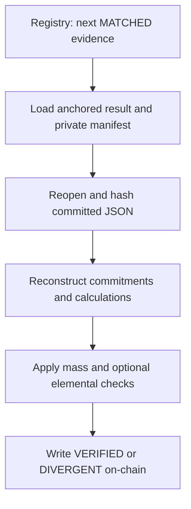

# ExploreChem Auditor Workflow

This directory contains ExploreChem's independent audit workflow. It starts from evidence already in `MATCHED` state, retrieves the anchored mass result and its private source material, independently reconstructs the applicable commitments and calculations, applies the configured audit rules, and writes the final evidence state to Ethereum through a Chainlink CRE report.

The implementation keeps the historical workflow identifier `PAIRWISE_MASS_AUDITOR`, while the current producer integration uses `ExploreChem/PrivateDocumentMass/v2` results created by `DOCUMENT_MASS_BALANCE`.

## Technology

| Layer | Technology and use |
|---|---|
| Workflow runtime | Chainlink CRE SDK for triggers, confidential execution, EVM reads, and signed reports |
| Confidential handler | `handlerInTee` requesting AWS Nitro in `us-west-2` |
| Language | TypeScript |
| Runtime validation | Zod schemas for configuration, database responses, private manifests, and elemental-balance inputs |
| EVM encoding and hashing | viem for ABI encoding and decoding, Keccak-256, SHA-256, and byte conversion |
| Blockchain | Ethereum Sepolia registry as the authority for eligibility and final evidence state |
| Private data | Supabase PostgREST and Storage for evidence lookup, original JSON, primary result, and audit receipt |
| Arithmetic | `bigint` and rational integer operations for deterministic mass and elemental calculations |

The CRE simulator is not a real TEE. Simulator logs are visible for debugging and must not receive production-sensitive values.

## Workflow identity

| Item | Current value |
|---|---|
| Workflow output name | `PAIRWISE_MASS_AUDITOR` |
| Discovery method | `BLOCKCHAIN_GET_NEXT_MATCHED` |
| State authority | `BLOCKCHAIN` |
| Current producer manifest | `ExploreChem/PrivateDocumentMass/v2` |
| Legacy compatible manifest | `ExploreChem/PrivatePairwiseMass/v1` |
| Audit receipt schema | `ExploreChem/PairwiseMassAudit/v2` |
| Trigger | Cron |
| Default schedule | `0 */5 * * * *` |
| On-chain report | Report type `3` |

## Execution flow

For each trigger, the Auditor:

1. calls `getNextMatched()` on the registry;
2. rereads the selected evidence and confirms state `MATCHED`;
3. obtains `latestResultIdByEvidence(evidenceId)`;
4. reads the anchored balance result with `getResult(resultId)`;
5. locates the private evidence row in Supabase;
6. opens `mass-results/{evidenceId}/{resultId}.json`;
7. validates the private manifest with Zod;
8. reloads and hashes the applicable original JSON document or documents;
9. reconstructs the primary result commitments;
10. reproduces the supported mass calculation;
11. applies the configured mass tolerance;
12. audits an optional `elementalBalance` block;
13. derives `VERIFIED` or `DIVERGENT`;
14. sends report type `3` through the configured Chainlink forwarder;
15. rereads the evidence and confirms its final on-chain state;
16. writes the private audit receipt.



## Blockchain-first discovery

The registry decides which evidence can be audited. The workflow reads:

- `getNextMatched()`;
- `getEvidence(evidenceId)`;
- `latestResultIdByEvidence(evidenceId)`;
- `getResult(resultId)`;
- `verifyResultHash(resultId, candidateHash)`.

Supabase is used only after the registry selects an eligible evidence ID.

When no `MATCHED` evidence exists, the workflow returns a no-work response. When a `MATCHED` evidence has no anchored mass result yet, it remains `MATCHED` for a later trigger.

## Supported manifest modes

### DOCUMENT_MASS_V2_SINGLE_EVIDENCE

This is the mode used for results from the current `DOCUMENT_MASS_BALANCE` workflow.

The Auditor requires:

- schema `ExploreChem/PrivateDocumentMass/v2`;
- one `sourceEvidenceId` equal to the selected evidence;
- one `sourceActorId` equal to the on-chain actor;
- one `sourceEvidenceHash` equal to the on-chain evidence hash;
- exactly one evidence in `evidenceIds`;
- an empty `correlationEdges` array;
- zero mass pairs for laboratory evidence;
- one `DOCUMENT_MASS_BALANCE` pair for other supported actor types;
- the pair's evidence and actor identifiers to match the selected evidence;
- pair and result status `NAO_ATESTADO` as created by the producer.

For this mode, the workflow reloads only the selected evidence document.

### Legacy pairwise compatibility

The Auditor also accepts `ExploreChem/PrivatePairwiseMass/v1`. That compatibility branch reconstructs the committed physical-handoff pair and its associated evidence documents according to the legacy manifest.

The compatibility mode returned in the simulation output identifies which branch ran.

## Original JSON verification

The Auditor downloads the original evidence object from its private `storage_bucket` and `storage_path`. It hashes the original bytes using the algorithm declared by the evidence row:

- SHA-256 for `SHA-256` or `SHA256`;
- Keccak-256 for `KECCAK256` or `KECCAK-256`.

The recalculated file hash must equal the registry's on-chain `evidenceHash` before the JSON is parsed or used.

If the Supabase row's stored `evidence_hash` differs from the registry but the downloaded JSON bytes reproduce the on-chain hash, the Auditor records a `rowHashWarning`. The blockchain commitment and the verified file bytes remain the integrity reference.

## Commitment reconstruction

The Auditor reconstructs and checks:

| Field | Verification |
|---|---|
| `canonicalResultHash` | Recomputed from the canonical private manifest result |
| `resultHash` | Compared with both the private manifest and the on-chain result |
| `aggregateInputHash` | Recomputed with the schema-specific input domain and compared with private and on-chain values |
| `resultId` | Recomputed from actor, evidence, calculation version, and result hash |
| `calculationVersion` | Compared with the anchored result |
| Result ownership | Evidence ID and actor ID compared across evidence, manifest, and on-chain result |
| On-chain verification | `verifyResultHash(resultId, recomputedResultHash)` must return `true` |

For `PrivateDocumentMass/v2`, `aggregateInputHash` is reconstructed with the `ExploreChem/DocumentMassInput/v2` domain. The result hash and result ID retain the deployed commitment domains used by the primary implementation.

## Document mass reproduction

For `PrivateDocumentMass/v2`, the current Auditor reproduces the mass fields implemented in `independentlyAuditSingleDocument()`.

### Carrier

```text
left  = custody.massCollectedKg | collectedMassKg | inputMassKg
right = custody.massDeliveredKg | deliveredMassKg | outputMassKg
delta = left - right
```

### Other supported physical actors

```text
left = first supported input mass
right = first supported product mass + optional scrap mass
delta = left - right
```

Supported input paths:

- `transformation.inputMassKg`;
- `transformation.inputProductMassKg`;
- `recovery.inputMassKg`;
- `inputMassKg`;
- `massBalance.inputMassKg`.

Supported product paths:

- `transformation.outputMassKg`;
- `transformation.outputProductMassKg`;
- `transformation.finishedProductMassKg`;
- `recovery.recoveredProductMassKg`;
- `outputMassKg`;
- `recoveredMassKg`;
- `massBalance.outputMassKg`.

Supported scrap paths in this Auditor implementation:

- `transformation.scrapMassKg`;
- `scrapMassKg`.

All reproduced values are converted to integer milligrams. The Auditor verifies `leftMassMg`, `rightMassMg`, selected field names, `deltaMg`, pair ownership, pair count, and the producer's `NAO_ATESTADO` status.

## Mass tolerance

The default mass tolerance is 200 basis points, equal to 2% of the pair's left-side reference mass:

```text
absoluteDeltaMg * 10000 <= leftMassMg * massToleranceBps
```

The recalculated status is:

- `CONFORME` when both operands exist and the absolute difference is within tolerance;
- `DIVERGENTE` when both operands exist and the absolute difference exceeds tolerance;
- `NAO_ATESTADO` when one or both operands are unavailable.

For `PrivateDocumentMass/v2`:

- `DIVERGENTE` produces a final `DIVERGENT` evidence verdict;
- `CONFORME` can produce `VERIFIED` when every other check passes;
- `NAO_ATESTADO` can also produce `VERIFIED` when every integrity and applicable calculation check passes.

The tolerance policy is recorded in the receipt as `OUTGOING_MASS`, with `arbitrated: true`.

## Optional elemental-balance audit

When the committed JSON contains `elementalBalance`, the Auditor validates `ExploreChem/PeriodicElementalBalance/v1` and independently calculates its elemental totals.

Supported elements:

- Nd;
- Pr;
- Dy;
- Tb.

Supported stream types:

- `INPUT`;
- `PRODUCT`;
- `WASTE`;
- `PURGE`;
- `EFFLUENT`;
- `OPENING_INVENTORY`;
- `CLOSING_INVENTORY`.

Supported declared bases:

- `AS_RECEIVED`;
- `DRY_105C`;
- `CALCINED`;
- `LIQUID_TOTAL`.

The elemental audit:

- validates actor and declared period;
- requires unique stream IDs and unique elements inside each stream;
- verifies that weighing timestamps are inside the declared period;
- normalizes mass to the declared basis;
- checks the required moisture fields for `AS_RECEIVED` streams;
- requires drying temperature between 100 °C and 110 °C for that conversion;
- applies loss-on-ignition correction to calcined streams;
- validates the allowed reported form and unit;
- converts supported oxides into elemental mass using factor table version `1.0.0`;
- compares recalculated and declared elemental mass in milligrams;
- aggregates input, product, other-output, opening-inventory, and closing-inventory mass per element;
- recalculates declared MUF per element;
- calculates private product recovery in parts per million;
- produces a deterministic `ExploreChem/PeriodicElementalBalanceAudit/v1` result hash.

For each supported element:

```text
MUF = input
    + opening inventory
    - product
    - waste
    - purge
    - effluent
    - closing inventory
```

When `elementalBalance` is absent, the elemental audit returns `NOT_PRESENT`. If `requireElementalBalance` is `true`, absence of that block becomes an audit error. Otherwise, the Auditor continues with the available document-mass and integrity checks.

## Final verdict

The Auditor combines:

- manifest and on-chain consistency errors;
- reconstructed commitment errors;
- independently reproduced document errors;
- mass-tolerance result;
- optional elemental-balance errors.

The final evidence state is:

- `VERIFIED` when the combined error list is empty;
- `DIVERGENT` when the combined error list contains at least one verdict-producing error.

Infrastructure, access, parsing, or other execution failures caught by the outer handler return `RETRY_REQUIRED`. No audit report is derived from that failure, and the evidence remains `MATCHED` for a later attempt.

## On-chain report

The Auditor sends report type `3` with the registry's fixed-width report layout:

```text
reportType
evidenceId
resultId
actorId
resultHash
previousResultId
aggregateInputHash
balanceStatus
calculationVersion
```

For report type `3`, only `reportType`, `evidenceId`, and the final evidence status carried in `balanceStatus` are populated. The remaining fields are zeroed according to the deployed receiver ABI.

The workflow waits for the transaction, checks receiver execution status, rereads the evidence, and requires the observed final state to match the calculated verdict.

## Private audit receipt

After confirming the on-chain state, the Auditor writes:

```text
audit-results/{evidenceId}/{resultId}.json
```

The receipt contains:

- audited manifest schema and compatibility mode;
- evidence, actor, and result identifiers;
- anchored result commitments and calculation version;
- independent document-verification status, counts, warnings, and errors;
- declared and recalculated mass status;
- tolerance policy and individual checks;
- elemental-balance requirement and result;
- final verdict and complete error list;
- audit transaction hash.

The deterministic receipt path is written with Storage upsert enabled.

## Supabase boundary

The Auditor uses Supabase to:

- locate the selected evidence's private object;
- read actor metadata;
- open the primary result manifest;
- download the original evidence JSON;
- write the private audit receipt.

The Auditor does not patch the evidence state in Supabase. After the report is confirmed, its simulation output explicitly records:

```json
{
  "supabaseMirror": {
    "updated": false,
    "policy": "DISABLED_ONCHAIN_ONLY"
  }
}
```

Ethereum remains the authority for `MATCHED`, `VERIFIED`, and `DIVERGENT`.

## Configuration

Configuration is validated with Zod before the workflow runner starts.

| Property | Required | Purpose |
|---|---:|---|
| `supabaseUrl` | Yes | Base URL for PostgREST and Storage requests |
| `secretNamespace` | Yes | CRE secret namespace containing `SUPABASE_SERVICE_ROLE_KEY` |
| `chainSelectorName` | Yes | CRE EVM testnet selector name |
| `contractAddress` | Yes | ExploreChem registry that receives the audit report |
| `gasLimit` | Yes | Decimal gas limit passed to `writeReport` |
| `auditSchedule` | No | Cron expression; defaults to `0 */5 * * * *` |
| `requireElementalBalance` | No | Makes the `elementalBalance` block mandatory when `true` |
| `massToleranceBps` | No | Integer from 0 to 10,000; defaults to `200` |

The workflow obtains `SUPABASE_SERVICE_ROLE_KEY` from the configured secret namespace. The secret value must remain outside Git and the JSON configuration files.

## Run the Auditor

From the repository root on Windows Command Prompt:

```bat
cre workflow simulate .\auditor-workflow --broadcast
```

From the repository root in Bash:

```bash
cre workflow simulate ./auditor-workflow --broadcast
```

After entering `auditor-workflow` itself:

```bash
cre workflow simulate . --broadcast
```

`--broadcast` is required when the simulator should submit report type `3` to Sepolia.

## Simulation responses

The workflow can return:

- no `MATCHED` evidence awaiting audit;
- `MATCHED` evidence without an anchored mass result;
- evidence that changed state before audit;
- `RETRY_REQUIRED` with no derived verdict;
- a completed audit result.

A completed result includes:

- `evidenceId` and `actorId`;
- `resultId`, `resultHash`, and `aggregateInputHash`;
- audited manifest schema and compatibility mode;
- independent verification counts, warnings, and errors;
- declared and recalculated mass status;
- tolerance policy and checks;
- elemental audit result;
- final evidence status;
- audit transaction hash;
- Supabase state-mirror policy;
- private audit receipt path.

## Files

```text
auditor-workflow/
  README.md
  main.ts
  main.test.ts
  config.staging.json
  config.production.json
  workflow.yaml
  package.json
  tsconfig.json
```

## License

Apache License 2.0. See the repository root [LICENSE](../LICENSE).

