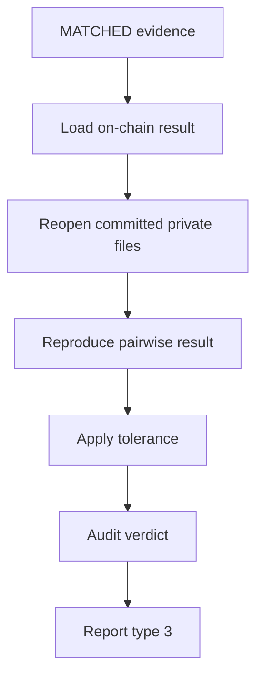
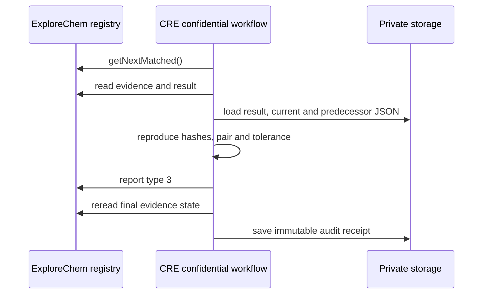

# ExploreChem Auditor Workflow

Independent Chainlink CRE workflow configured with `handlerInTee` to audit matched ExploreChem evidence and independently reproduce its committed pairwise mass result.

This workflow is separate from `LOT_CHAIN_PAIRWISE_MASS`. It does not discover `PENDING` evidence, rebuild the custody graph, or replace the result created by the primary workflow.

- Network: Ethereum Sepolia
- Chain ID: `11155111`
- Registry contract: [`0xcd5eDA10c0b3424999626e6A2DaB2909B982866c`](https://sepolia.etherscan.io/address/0xcd5eDA10c0b3424999626e6A2DaB2909B982866c)
- Current workflow name: `PAIRWISE_MASS_AUDITOR`

## Responsibility

The Auditor starts from evidence already in `MATCHED` state.

It verifies the result created by the primary workflow through these steps:

1. selects the next `MATCHED` evidence from the blockchain;
2. retrieves the corresponding private result JSON;
3. compares the private result commitments with the result anchored on-chain;
4. reopens only the current evidence and its direct predecessor;
5. recalculates both original document hashes and compares them with their on-chain evidence hashes;
6. independently reproduces the direct pairwise mass calculation;
7. applies the configured tolerance to the reproduced difference;
8. records a new private audit receipt and sends the final evidence classification on-chain.



The final evidence transition is:

- `VERIFIED` when the committed result, both source documents, direct pair and tolerance check are reproducible and accepted;
- `DIVERGENT` when integrity, scope, ownership, calculation, required mass, or tolerance validation fails;
- unchanged `MATCHED` when the evidence does not yet have an on-chain balance result.

## Relationship with the primary workflow

| Concern | Primary pairwise workflow | Auditor workflow |
|---|---|---|
| Discovery | Next `PENDING` evidence | Next `MATCHED` evidence |
| Custody correlation | Creates the direct relation | Confirms only the committed direct relation |
| Physical handoff calculation | Creates it | Reproduces it |
| Original document hash | Verifies it | Verifies it again |
| Private result hash | Creates it | Recomputes it |
| Final evidence state | `MATCHED` | `VERIFIED` or `DIVERGENT` |
| Contract report | Types 1 and 2 | Type 3 |

## Blockchain-first discovery

The Auditor calls `getNextMatched()` on the registry. Supabase is not used to decide which evidence is eligible.

After discovery, it reads:

- `getEvidence(evidenceId)`;
- `latestResultIdByEvidence(evidenceId)`;
- `getResult(resultId)`;
- `verifyResultHash(resultId, candidateHash)`.

The evidence must still be `MATCHED` when processing begins.

## Pairwise result audit

The Auditor retrieves the private result from:

```text
mass-results/{evidenceId}/{resultId}.json
```

It verifies that:

- the private result belongs to the selected evidence;
- the source actor matches the on-chain actor;
- the source evidence hash matches the on-chain commitment;
- the result stored on-chain belongs to the same evidence and actor;
- `aggregateInputHash` is reproducible;
- `canonicalResultHash` is reproducible;
- private `resultHash` equals the canonical hash;
- on-chain `resultHash` equals the recomputed hash;
- `resultId` is reproducible;
- `verifyResultHash` returns `true`;
- the manifest belongs to the current evidence and contains only its applicable direct pair;
- the current evidence and its direct predecessor reproduce their individual on-chain document hashes;
- every `deltaMg` is correct;
- every pairwise status is correct;
- the result-level mass status is correct;
- the absolute difference is within the configured tolerance;
- the on-chain mass status agrees with the recomputed result.

The audit uses `massToleranceBps`, with a current default of 200 basis points: 2% of the outgoing mass. This percentage is provisional and must be replaced if the project team approves another measurement policy.

A missing required mass, a non-reproducible result, an invalid direct-pair scope, or a difference outside the tolerance produces `DIVERGENT`. The custody relation remains historically recorded; the Auditor is judging the result, not deleting the relation.

## Original evidence verification

The Auditor downloads the original evidence JSON using the private `storage_bucket` and `storage_path`.

It recalculates the configured hash:

- SHA-256 for `SHA-256` or `SHA256`;
- Keccak-256 for `KECCAK256` or `KECCAK-256`.

The recalculated file hash, the Supabase index hash, and the on-chain `evidenceHash` must all agree before the document is used.

## Tolerance policy

The Auditor recalculates the absolute pairwise difference and compares it with a percentage of the outgoing mass:

```text
absoluteDeltaMg × 10,000 <= outgoingMassMg × toleranceBps
```

The current default is:

```text
massToleranceBps = 200 = 2%
```

This value is marked as arbitrated because it is a provisional project rule rather than a formal measurement-uncertainty budget. A nonzero difference can therefore be accepted when it remains inside the configured limit.

## Current on-chain boundary

The current registry receives the Auditor decision through report type 3:

```text
reportType
evidenceId
resultId
actorId
resultHash
previousResultId
aggregateInputHash
balanceStatus
calculationVersion
```

For report type 3, the unused result fields are zeroed and `balanceStatus` carries evidence status `VERIFIED` or `DIVERGENT`, according to the contract ABI.

The current audit report changes the evidence state. Detailed calculations and detected errors remain in the private audit receipt; they are not published on-chain.

## Private audit receipt

After the on-chain transition is confirmed, the Auditor writes:

```text
audit-results/{evidenceId}/{resultId}.json
```

The receipt contains:

- evidence and actor identifiers;
- original result commitments;
- pairwise recalculated status;
- the applied tolerance policy and checks;
- every detected error;
- final verdict;
- audit transaction hash.

The receipt does not replace the original evidence or pairwise result. Its deterministic path is reused if the same result is audited again, while the original evidence and on-chain result history remain preserved.

## Report sequence



The Supabase state is mirrored only after the Auditor rereads the expected final state from Ethereum Sepolia.

## Configuration

The workflow requires these configuration properties:

| Property | Purpose |
|---|---|
| `supabaseUrl` | Base URL of the private Supabase project |
| `secretNamespace` | Namespace containing the service-role secret |
| `chainSelectorName` | CRE EVM chain selector name for Sepolia |
| `contractAddress` | ExploreChem registry address |
| `gasLimit` | Gas limit used by `writeReport` |
| `auditSchedule` | Optional cron expression; default is every five minutes |

The TEE retrieves `SUPABASE_SERVICE_ROLE_KEY` from the configured secret namespace. The service-role key must not be committed to Git.

## Running the workflow

From the repository root:

```bash
cre workflow simulate auditor-workflow --broadcast
```

The `--broadcast` flag is required for the simulator to submit report type 3 to Sepolia.

The simulator is not a real TEE and must not receive production-sensitive material. A deployed confidential execution environment would be responsible for protecting the original document and detailed calculations.

## Expected simulation outcomes

No matched evidence:

```json
{
  "workflow": "PAIRWISE_MASS_AUDITOR",
  "message": "nenhuma evidencia MATCHED aguardando auditoria"
}
```

Matched evidence without a balance result:

```json
{
  "workflow": "PAIRWISE_MASS_AUDITOR",
  "message": "evidencia MATCHED ainda sem resultado de massa; permanece MATCHED"
}
```

Processed evidence returns the pairwise result identifiers, independent verification counts, recomputed mass status, tolerance checks, audit errors, final evidence status, audit transaction hash, and private receipt path.

## Security properties

- Blockchain state determines audit eligibility.
- Original evidence bytes are hashed again before parsing.
- The private pairwise manifest is independently canonicalized.
- Actor and evidence ownership are checked across every layer.
- No JavaScript floating-point value participates in committed mass arithmetic.
- Existing pairwise and evidence history is never deleted.
- Supabase is updated only after confirmation of the on-chain final state.

## Limitations

- The workflow validates commitments and declared pairwise arithmetic; it cannot prove that a physical delivery or measurement was truthful.
- The workflow processes one matched evidence per trigger.

## Files

```text
auditor-workflow/
  README.md
  main.ts
  main.test.ts
  config.staging.json
  config.production.json
  workflow.yaml
  package.json
  tsconfig.json
```

## License

Apache License 2.0. See the repository root [LICENSE](../LICENSE).
