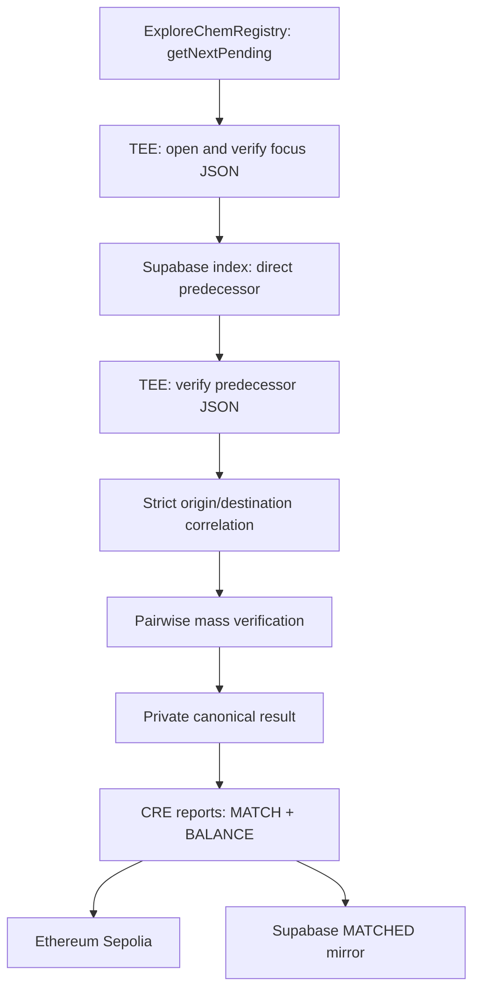

# ExploreChem CRE/TEE — Pairwise Mass Correlation Workflow

Confidential Chainlink CRE workflow for discovering physical handoffs between private supply-chain evidence, checking document integrity, calculating pairwise mass differences, and anchoring deterministic results on Ethereum Sepolia.

This directory contains the implemented workflow responsible for moving one new evidence from `PENDING` to `MATCHED` and anchoring its mass result. Final evidence audit is assigned to the separate implemented `PAIRWISE_MASS_AUDITOR` workflow.

## What this workflow does

For each execution, the workflow:

1. Reads the next `PENDING` evidence directly from `ExploreChemRegistry`.
2. Locates only the corresponding Supabase row.
3. Downloads the original private JSON inside the TEE execution.
4. Recalculates the document hash and compares it with the hash anchored on-chain.
5. Confirms that the evidence belongs to the same `actorId` recorded on-chain.
6. Extracts the committed `lotId`, origin, destination, actor type, and applicable mass fields.
7. Uses the Supabase index to locate the directly preceding evidence for the same physical handoff.
8. Downloads that predecessor JSON and verifies its hash against its own on-chain commitment.
9. Confirms the strict origin/destination relationship between the predecessor and the focus evidence.
10. Compares the predecessor's outgoing mass with the focus evidence's incoming mass.
11. Emits supported elemental calculations when the required source fields exist.
12. Produces deterministic `pairId`, `aggregateInputHash`, `resultHash`, and `resultId` values.
13. Stores the complete detailed result as private JSON in Supabase Storage.
14. Sends one correlation report and one balance report through the CRE forwarder.
15. Mirrors the resulting state and identifiers in Supabase after the authoritative blockchain operations.

## Architecture



The blockchain is the authority for identity, document hashes, evidence status, and anchored balance results. Supabase is used for private-file storage, actor lookup, candidate indexing, and UI mirroring.

## Core design decisions

### Blockchain-first discovery

The workflow always starts with:

```solidity
getNextPending()
```

Supabase does not choose the authoritative evidence. A candidate can become the focus only when `getEvidence(evidenceId)` confirms `EvidenceStatus.PENDING` on-chain.

### The result belongs to the focus evidence

Each execution creates one result for the selected focus evidence and its direct predecessor.

For a carrier-to-refiner handoff:

```text
predecessor = carrier evidence
focus = refiner evidence
comparison = carrier delivered mass versus refiner input mass
result scope = refiner actorId and refiner evidenceId
```

Each later focus evidence receives its own result. Previous evidence and results remain in history.

### Strict physical correlation

A `PHYSICAL_HANDOFF` is accepted only when all three conditions are true:

```text
from.lotId == to.lotId
from.destinationActorId == to.ownerActorId
to.originActorId == from.ownerActorId
```

There is no fallback to approximate actor names, equal masses, nearby timestamps, or self-referential origin/destination values.

Mass does not discover a relationship. Mass is evaluated only after the relationship has been established.

### Supabase is an index, not proof

The `lot_reference` database column narrows candidate discovery to one lot. It does not prove that a candidate belongs to that lot.

For the focus and selected predecessor, the workflow:

- reads the corresponding evidence on-chain;
- downloads the original JSON;
- recalculates the declared hash algorithm;
- checks the document hash against the blockchain;
- confirms the owner `actorId`;
- extracts the real `lotId` from the committed document;
- rejects any divergence between the index and the document.

### Direct predecessor scope

The workflow selects only the evidence immediately preceding the focus in the validated physical handoff. It does not reconstruct every document in the lot and does not calculate a global mass sum.

The predecessor and focus JSON files are both checked against their respective on-chain evidence commitments before their values participate in the result.

### Laboratory evidence is not a physical handoff

Laboratory evidence may be connected as `LAB_ANALYSIS` when it belongs to the same lot and points to the relevant destination actor.

It does not create a physical mass edge and does not generate a `PairMassResult`. Sample mass is analytical evidence, not custody-flow mass.

## Document integrity checks

The workflow accepts private JSON evidence using either:

- `SHA-256` / `SHA256`;
- `KECCAK-256` / `KECCAK256`.

An evidence is rejected before correlation when any of these checks fails:

| Check | Authoritative comparison |
| --- | --- |
| Evidence identifier | Supabase `evidence_id` against on-chain `evidenceId` |
| Indexed hash | Supabase `evidence_hash` against on-chain `evidenceHash` |
| Original document | Recalculated file hash against on-chain `evidenceHash` |
| Evidence owner | Supabase actor lookup against on-chain `actorId` |
| Actor type | JSON `actorType`, when present, against the registered actor type |
| Lot index | Supabase `lot_reference` against the committed JSON `lotId` |

The JSON actor identifier is not authoritative for ownership. Ownership is resolved through:

```text
explorerchem_evidences.actor_db_id
→ explorerchem_actors.actor_id
→ ExploreChemRegistry Evidence.actorId
```

## Mass-field selection

All accepted decimal kilogram values are converted to integer milligrams. Conversion uses deterministic half-up rounding when more than six decimal places are supplied.

### Outgoing side

| Origin actor type | Preferred field |
| --- | --- |
| `MINER` | `outputMassKg`, otherwise `massBalance.grossMassKg` |
| `CARRIER` | `custody.massDeliveredKg`, otherwise `outputMassKg` |
| `PROCESSOR` / `REFINER` | `transformation.outputMassKg` |
| `MANUFACTURER` to `RECYCLER` | `transformation.scrapMassKg` |
| Other `MANUFACTURER` handoff | `outputMassKg`, otherwise `transformation.scrapMassKg` |
| `RECYCLER` | `recovery.recoveredProductMassKg`, otherwise `outputMassKg` |

### Incoming side

| Recipient actor type | Preferred field |
| --- | --- |
| `CARRIER` | `custody.massCollectedKg`, then `inputMassKg`, then `massBalance.grossMassKg` |
| `PROCESSOR` / `REFINER` / `MANUFACTURER` / `RECYCLER` | `transformation.inputMassKg`, then `massBalance.grossMassKg`, then `custody.massCollectedKg` |
| Other physical recipient | `inputMassKg`, then `custody.massCollectedKg`, then `massBalance.grossMassKg` |
| `LABORATORY` | no physical mass |

## Pairwise calculation

For the direct physical handoff from the predecessor to the focus:

```text
deltaMg = leftMassMg - rightMassMg
```

The result is classified as:

| Condition | Status |
| --- | --- |
| `deltaMg == 0` | `CONFORME` |
| `deltaMg != 0` | `DIVERGENTE` |
| Either mass is absent | `NAO_ATESTADO` |

The mass workflow records the direct arithmetic result. Acceptance tolerance is evaluated later by the separate auditor. Where supported fields exist, this workflow can emit deterministic elemental calculations, but it does not claim a global elemental-conservation balance, moisture normalization, uncertainty propagation, or periodic MUF calculation.

## Deterministic commitments

No random salt or timestamp participates in the current commitment. Identical canonical inputs reproduce identical hashes.

The workflow uses explicit domain separation:

| Commitment | Domain |
| --- | --- |
| Pair identity | `ExploreChem/PairwiseMassPair/v1` |
| Relationship fingerprint | `ExploreChem/PairwiseMassRelation/v1` |
| Input commitment | `ExploreChem/PairwiseMassInput/v1` |
| Canonical result | `ExploreChem/PairwiseMass/v1` |
| Result identifier | `ExploreChem/PairwiseMassResultId/v1` |

The canonical result includes:

```text
calculationVersion
actorId
focusEvidenceId
lotReference
evidenceIds
correlationEdges
massPairs
status
```

`canonicalResultHash` is also used as the contract-facing `resultHash`.

## Private and public data boundaries

### Kept private

- original JSON documents;
- lot identifier;
- origin and destination references;
- company names and sites;
- individual mass values;
- selected mass-field names;
- correlation edges;
- complete pairwise calculation;
- private canonical result manifest.

### Anchored on-chain

- focus `evidenceId`;
- result owner `actorId`;
- deterministic `resultId`;
- deterministic `resultHash`;
- `aggregateInputHash`;
- balance status;
- calculation version;
- transaction and block history emitted by the contract.

Detailed private results are written to:

```text
mass-results/{focusEvidenceId-without-0x}/{resultId-without-0x}.json
```

## CRE report format

The workflow sends a static nine-word ABI report compatible with `ExploreChemRegistry.CREReport`:

| Position | Field | Type |
| ---: | --- | --- |
| 1 | `reportType` | `uint8` |
| 2 | `evidenceId` | `bytes32` |
| 3 | `resultId` | `bytes32` |
| 4 | `actorId` | `bytes32` |
| 5 | `resultHash` | `bytes32` |
| 6 | `previousResultId` | `bytes32` |
| 7 | `aggregateInputHash` | `bytes32` |
| 8 | `balanceStatus` | `uint8` |
| 9 | `calculationVersion` | `uint32` |

Encoded length:

```text
9 × 32 bytes = 288 bytes
```

This workflow emits:

- `reportType = 1` for evidence correlation;
- `reportType = 2` for the pairwise mass result.

It does not emit `reportType = 3`. Final audit belongs to the separate Auditor workflow.

## Evidence lifecycle

Within this workflow:

```text
PENDING
  → strict correlation and integrity verification
MATCHED
  → pairwise result already anchored, awaiting independent audit
```

The workflow deliberately ends at `MATCHED`. The separate `PAIRWISE_MASS_AUDITOR` workflow consumes `getNextMatched()` and finalizes the evidence as `VERIFIED` or `DIVERGENT`.

Each new shipment or order creates a new `evidenceId`. A historical evidence is never reused as the identity of a new transaction.

## Supabase dependencies

### `explorerchem_actors`

The workflow reads:

```text
id
actor_id
display_name
actor_type
active
created_at
```

### `explorerchem_evidences`

The workflow reads:

```text
evidence_id
actor_db_id
state
evidence_hash
hash_algorithm
storage_bucket
storage_path
mime_type
lot_reference
chain_created_at
```

After successful blockchain writes, it updates:

```text
state = MATCHED
matched_at
match_tx_hash
```

### Private Storage

The original document must be available at the authenticated object path represented by `storage_bucket` and `storage_path`.

The service-role key is never stored in the repository. It is requested inside the TEE from the configured secret namespace under:

```text
SUPABASE_SERVICE_ROLE_KEY
```

## Configuration

The workflow validates these configuration fields at startup:

| Field | Required | Purpose |
| --- | ---: | --- |
| `supabaseUrl` | yes | Supabase project URL |
| `secretNamespace` | yes | Namespace containing the service-role secret |
| `chainSelectorName` | yes | CRE EVM network selector name |
| `contractAddress` | yes | Deployed `ExploreChemRegistry` address |
| `gasLimit` | yes | Gas limit used by `writeReport` |
| `correlationSchedule` | no | Cron schedule override |

Default schedule:

```text
0 0 0 * * 0
```

The production trigger requests AWS Nitro in `us-west-2` through `handlerInTee`. The local simulator is not a real TEE and must not be used with production confidential data.

## Installation and simulation

Install dependencies inside the workflow directory:

```bash
cd explorerchem-workflow
bun install
```

Compile and simulate with blockchain writes enabled:

```bash
cre workflow simulate . --broadcast
```

Alternatively, from the repository root, target the workflow directory directly:

```bash
cre workflow simulate explorerchem-workflow --broadcast
```

`--broadcast` is required to persist the correlation and balance reports on Sepolia. Without it, the simulator can execute the logic but does not create the authoritative on-chain state transition.

Before broadcasting, the contract must trust the workflow ID delivered in the forwarder metadata. `expectedWorkflowId` protects correlation reports. Balance reports use `expectedBalanceWorkflowId` when it is nonzero; otherwise they fall back to `expectedWorkflowId`.

## Simulation progression fallback

Some simulation executions can return the same on-chain pending evidence when simulated writes do not advance state between runs.

The workflow contains a controlled fallback:

1. `getNextPending()` is still called first.
2. If that evidence is already `MATCHED` in the Supabase simulation mirror, the workflow loads a limited set of other Supabase rows still marked `PENDING`.
3. Every fallback candidate must independently return on-chain status `PENDING` before selection.

This mechanism exists only to advance simulation. It does not make Supabase authoritative.

The output identifies the selection path as either:

```text
CHAIN_GET_NEXT_PENDING
SIMULATION_PROGRESS_FALLBACK
```

## Failure behavior

The workflow does not anchor a result when:

- no on-chain `PENDING` evidence exists;
- the focus evidence cannot be resolved in Supabase;
- the original file is missing or is not JSON;
- the indexed hash diverges from the blockchain;
- the recalculated document hash diverges from the blockchain;
- the document owner diverges from the on-chain actor;
- `lotId` is absent;
- the `lot_reference` index diverges from the committed document;
- origin and destination are both absent;
- no strict outgoing physical handoff exists for the focus;
- the focus leaves `PENDING` before the final write gate;
- the CRE report transaction fails;
- the receiver contract reverts.

Candidate-specific failures are isolated in `candidateErrors`, allowing other valid same-lot candidates to continue through correlation.

## What this workflow does not claim

This implementation does not claim to:

- prove that a physical delivery happened in the real world without independently submitted recipient evidence;
- perform periodic plant-wide mass reconciliation;
- provide complete elemental-conservation coverage for every actor, compound, or material;
- normalize wet, dry, calcined, or liquid mass bases;
- calculate inventory-adjusted MUF;
- define the final industrial measurement-uncertainty policy; the separate auditor currently uses a provisional 2% rule;
- preserve molecular identity after material transformation;
- replace sampling, laboratory accreditation, or commercial arbitration;
- finalize evidence as `VERIFIED` or `DIVERGENT` without the separate Auditor workflow.

## Current scope and auditor workflow

The implemented scope closes one responsibility:

> Given private evidence anchored by hash, discover the next strict physical handoff, compare the origin's outgoing mass with the recipient's incoming mass, and anchor a deterministic result owned by the origin evidence.

The independent `PAIRWISE_MASS_AUDITOR` workflow consumes evidence left as `MATCHED`, reproduces the committed private result, verifies the applicable source documents and calculations, applies its audit policy, and issues the final `VERIFIED` or `DIVERGENT` evidence verdict.

## Author

**Armando Freire** — technical design, smart contracts, Chainlink CRE/TEE workflow, Supabase integration, and blockchain anchoring.

ExploreChem is being developed for ETHOnline 2026. Demonstration company names, lot identifiers, document references, quantities, and results are fictional.

** Jéssica ** — Product Lead

Responsible for product leadership, problem framing, requirements, user experience, business validation, product communication, and presentation strategy.

The original concept and product vision belong to Armando Freire and Jéssica. All final product decisions, source code, documentation, demonstrations, and submissions are reviewed and approved by the ExploreChem team. The team retains full authorship and responsibility for the project.
