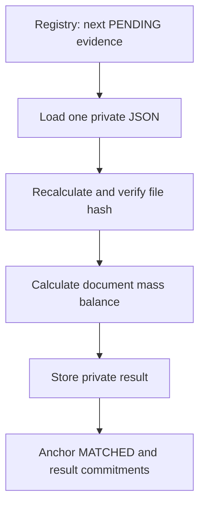

# ExploreChem — Document Mass Balance CRE Workflow

This directory contains ExploreChem's primary Chainlink CRE workflow. It verifies one privately stored JSON document against its Ethereum Sepolia commitment, calculates a document-scoped mass balance, stores the detailed result privately, and anchors deterministic result commitments on-chain.

This README documents the implementation in `explorerchem-workflow/main.ts`. For the repository overview, see the [project README](../README.md).

## Current workflow identity

| Item | Current value |
|---|---|
| Workflow output name | `DOCUMENT_MASS_BALANCE` |
| Primary result schema | `ExploreChem/DocumentMassResult/v2` |
| Private manifest schema | `ExploreChem/PrivateDocumentMass/v2` |
| Calculation version | `1` |
| Trigger | Cron |
| Confidential handler | `handlerInTee` |
| Requested TEE | AWS Nitro, `us-west-2` |
| Network used by the demonstration | Ethereum Sepolia |
| Registry | `0xae2FdfcC9584442616fDa974b0a3C101806ff7D5` |

The CRE simulator is not a real TEE. Simulator logs are visible for debugging and must not be used for production secrets.

## What this workflow does

For one evidence record, the workflow:

1. asks the registry for the next `PENDING` evidence;
2. performs a point lookup for that exact `evidenceId` in Supabase;
3. downloads its original JSON from private storage;
4. recalculates the configured SHA-256 or Keccak-256 file hash;
5. compares the result with the immutable on-chain `evidenceHash`;
6. resolves actor metadata through the evidence row while retaining the on-chain `actorId` as the result owner;
7. normalizes supported mass fields to integer milligrams;
8. calculates a document-scoped mass balance;
9. creates deterministic input and result commitments;
10. stores the detailed result in private storage;
11. moves new evidence from `PENDING` to `MATCHED`;
12. anchors the balance-result commitment;
13. confirms both on-chain postconditions before updating Supabase mirror fields.



## Current calculation scope

The workflow creates each result from exactly one hash-verified JSON.

- `evidenceIds` contains only the focus evidence.
- `fromEvidenceId` and `toEvidenceId` both refer to the focus evidence.
- `fromActorId` and `toActorId` both refer to its actor.
- `relationType` is `DOCUMENT_MASS_BALANCE`.
- `correlationEdges` is empty.
- Lot, origin, and destination are preserved as descriptive metadata.

## Mass calculation

### Non-carrier documents

For supported non-carrier evidence, the workflow calculates a MUF-style document balance:

```text
MUF = input + opening inventory
    - product output
    - scrap output
    - other outputs
    - closing inventory
```

The left side is:

```text
input + opening inventory
```

The right side is:

```text
product output + scrap output + other outputs + closing inventory
```

Opening inventory, closing inventory, scrap, and other outputs are optional. If an optional field is absent, it is not added. If a supplied field cannot be parsed as a valid mass, the relevant aggregate remains unknown instead of being replaced with zero.

Documents without inventory or other-output fields retain the simplified calculation based on the supported input, product-output, and scrap fields.

### Carrier documents

Carrier evidence uses the custody values contained in the same document:

```text
difference = collected mass - delivered mass
```

For example, 900 kg collected and 897 kg delivered produces:

```text
leftMassMg  = 900000000
rightMassMg = 897000000
deltaMg     = 3000000
```

The primary workflow records this calculation but does not issue the final tolerance verdict.

### Laboratory documents

Laboratory evidence does not create a physical mass pair in this workflow. Supported elemental calculations may still be emitted when the required fields are available.

## Supported mass fields

The first valid field in each applicable group is selected.

| Component | Supported paths |
|---|---|
| Input | `transformation.inputMassKg`, `transformation.inputProductMassKg`, `recovery.inputMassKg`, `inputMassKg`, `massBalance.inputMassKg` |
| Product output | `transformation.outputMassKg`, `transformation.outputProductMassKg`, `transformation.finishedProductMassKg`, `recovery.recoveredProductMassKg`, `outputMassKg`, `recoveredMassKg`, `massBalance.outputMassKg` |
| Scrap | `transformation.scrapMassKg`, `massBalance.scrapMassKg`, `scrapMassKg` |
| Opening inventory | `massBalance.openingInventoryMassKg`, `transformation.openingInventoryMassKg`, `openingInventoryMassKg` |
| Closing inventory | `massBalance.closingInventoryMassKg`, `transformation.closingInventoryMassKg`, `closingInventoryMassKg` |
| Other outputs | `massBalance.otherOutputMassKg`, `massBalance.otherOutputsMassKg`, `transformation.otherOutputMassKg`, `transformation.otherOutputsMassKg`, `otherOutputMassKg`, `otherOutputsMassKg` |
| Carrier collected mass | `custody.massCollectedKg`, `collectedMassKg`, `inputMassKg` |
| Carrier delivered mass | `custody.massDeliveredKg`, `deliveredMassKg`, `outputMassKg` |

Decimal kilogram values are converted deterministically to integer milligrams. The committed arithmetic does not depend on binary floating-point calculations.

## Elemental calculations

The workflow retains limited neodymium calculations when supported fields exist. Current calculation output can include:

- conversion from Nd2O3 mass and grade to elemental Nd;
- comparison with a declared elemental Nd mass;
- elemental partition using declared finished-product and scrap values.

The currently implemented elemental output covers these neodymium calculations.

## Why the mass status is NAO_ATESTADO

The producer deliberately records every primary mass pair and the overall primary result as `NAO_ATESTADO`.

`NAO_ATESTADO` does not mean that no calculation occurred. It means this workflow calculated and committed the available values without assigning the independent audit conclusion.

The separate auditor owns the final evidence transition:

```text
PENDING -> MATCHED -> VERIFIED
                   -> DIVERGENT
```

- `MATCHED`: this workflow verified the committed document and anchored its primary result.
- `VERIFIED`: the separate auditor reproduced the applicable commitments and checks without finding a divergence.
- `DIVERGENT`: the separate auditor found an integrity, reconstruction, calculation, or applicable-tolerance failure.

A primary result can therefore remain `NAO_ATESTADO` while the evidence later becomes `VERIFIED`. The statuses answer different questions and the auditor does not rewrite the immutable primary result.

## Hash verification

The evidence index declares one of these algorithms:

- `SHA-256`;
- `SHA256`;
- `KECCAK256`;
- `KECCAK-256`.

The workflow hashes the original downloaded bytes. It does not parse and reserialize the source JSON before verifying the file commitment.

If the recalculated hash differs from the registry's `evidenceHash`, processing stops before `MATCHED` and before the balance result is anchored.

## Deterministic commitments

The workflow uses stable JSON key ordering and domain-separated hashing. It excludes random salts and runtime timestamps from committed calculation content.

| Commitment | Meaning |
|---|---|
| `relationFingerprint` | Deterministic fingerprint of the document calculation scope and mass-pair output |
| `aggregateInputHash` | Commitment to the source evidence hash, actor, evidence, and calculation scope |
| `resultHash` | Commitment to the complete canonical result |
| `canonicalResultHash` | Alias of `resultHash` in the current implementation |
| `resultId` | Deterministic identifier derived from the evidence, actor, calculation version, and result hash |

`aggregateInputHash` is the deterministic commitment for the complete input scope used by this workflow.

The current v2 implementation uses `ExploreChem/DocumentMassInput/v2` for the input commitment. Some internal domain strings retain historical `PairwiseMass` names solely for deployed compatibility.

## Private result

The detailed result is written to:

```text
mass-results/{focusEvidenceId}/{resultId}.json
```

The private manifest uses `ExploreChem/PrivateDocumentMass/v2` and includes:

- source evidence ID, actor ID, and evidence hash;
- lot reference;
- evidence scope;
- empty correlation-edge list;
- selected mass fields and integer values;
- signed mass difference when both operands exist;
- limited elemental calculations;
- calculation version;
- deterministic commitments;
- storage location;
- transaction hashes.

The detailed masses and calculation fields remain off-chain.

The Supabase balance-result table is append-only. Duplicate retries use `resolution=ignore-duplicates`; the workflow does not update an existing immutable result through an upsert.

## On-chain reports

The registry receives signed CRE reports through the configured forwarder.

### Report type 1 — primary state transition

For new evidence, report type 1 moves the evidence from `PENDING` to `MATCHED`.

The workflow immediately reads the evidence again. If the registry does not confirm state `MATCHED`, execution fails and no successful result is reported.

### Report type 2 — balance commitment

The second report contains:

```text
reportType
evidenceId
resultId
actorId
resultHash
previousResultId
aggregateInputHash
balanceStatus
calculationVersion
```

For the current initial revision:

- `previousResultId` is zero;
- `balanceStatus` is the contract value for `NAO_ATESTADO`;
- `calculationVersion` is `1`.

The workflow then reads the latest result for that evidence and requires the anchored `resultId` to equal the locally calculated `resultId`.

## Recovery and idempotency

If there is no `PENDING` evidence, the workflow checks for a `MATCHED` evidence that has no balance result. This recovery path handles an earlier execution whose state-transition report succeeded but whose balance report did not complete.

The workflow does not use the Supabase state mirror to authorize recovery. Both the `MATCHED` state and the absence of an anchored result are read from the registry.

The workflow returns without creating another result when the selected `MATCHED` evidence already has one. It also refuses to create a second initial result for an evidence whose latest result ID is nonzero.

## Supabase's role

Supabase provides:

- the actor directory used to normalize actor references;
- a point lookup from `evidenceId` to the private object;
- the private storage bucket and path;
- a mirror of confirmed on-chain state;
- an append-only index of detailed balance results.

Supabase does not decide whether evidence is `PENDING`, `MATCHED`, `VERIFIED`, or `DIVERGENT`. The Ethereum registry is authoritative.

The workflow retrieves the `SUPABASE_SERVICE_ROLE_KEY` from the configured CRE secret namespace. Never commit the secret value to this repository or place it directly in `config.staging.json` or `config.production.json`.

## Configuration

Configuration is validated with Zod before the runner starts.

| Key | Required | Purpose |
|---|---:|---|
| `supabaseUrl` | Yes | Base URL used for private index and storage requests |
| `secretNamespace` | Yes | CRE namespace containing `SUPABASE_SERVICE_ROLE_KEY` |
| `chainSelectorName` | Yes | CRE EVM testnet selector name |
| `contractAddress` | Yes | ExploreChem registry that receives reports |
| `gasLimit` | Yes | Decimal gas limit used by `writeReport` |
| `correlationSchedule` | No | Cron schedule; the name is retained from the earlier workflow design |

When `correlationSchedule` is absent, the code uses:

```text
0 0 0 * * 0
```

Workflow IDs, forwarder configuration, storage location, Supabase project configuration, and secrets are environment-specific and remain in the active configuration and secret namespace.

## Run locally

From the repository root on Windows Command Prompt:

```bat
cre workflow simulate .\explorerchem-workflow --broadcast
```

From the repository root in Bash:

```bash
cre workflow simulate ./explorerchem-workflow --broadcast
```

After entering the workflow directory itself, use:

```bash
cre workflow simulate . --broadcast
```

`--broadcast` is required when the simulation should transmit the generated reports to Sepolia.

A successful primary execution returns fields including:

- `workflow`;
- `initialBlockchainPendingId`;
- `pendingSelectionMode`;
- `focusEvidenceId`;
- `focusLotReference`;
- `massPolicy`;
- `massPairs`;
- `elementalCalculations`;
- `massStatus`;
- `relationFingerprint`;
- `resultHash`;
- `resultId`;
- `aggregateInputHash`;
- private result path;
- `matchTxHash`;
- `resultTxHash`.

## Failure behavior

The workflow fails or exits safely when:

- no eligible evidence exists;
- the on-chain state changes before a write;
- the evidence row cannot be resolved;
- the private object cannot be downloaded;
- the file is not valid JSON;
- the file hash differs from the chain;
- the evidence row or its referenced actor metadata cannot be resolved;
- a required configuration value or secret is absent;
- the registry does not confirm `MATCHED` after report type 1;
- an initial result already exists;
- the registry does not return the expected `resultId` after report type 2;
- private-result persistence or confirmed-state mirroring fails.

No mass difference by itself causes this primary workflow to write `DIVERGENT`. The independent auditor owns that decision.

## Security notes

- The chain is authoritative for processing state.
- The original document remains private.
- The exact downloaded bytes are verified against the chain.
- Committed arithmetic uses integers.
- Result commitments are deterministic and reproducible.
- The workflow writes through the configured Chainlink forwarder.
- Private database mirrors are updated only after confirmed on-chain postconditions.
- Operational confidentiality still depends on correct Supabase RLS, Storage policies, secret management, and production TEE deployment.
- The simulator is for debugging and is not a secure enclave.

## Relationship to the auditor

This workflow ends at `MATCHED` and anchors the primary calculation. The separate auditor consumes the anchored result, reconstructs its commitments from the private result and source JSON, repeats supported calculations, applies its configured tolerance, and writes `VERIFIED` or `DIVERGENT` on-chain.

Keeping the workflows separate allows later auditors to evaluate additional properties without modifying the original evidence or primary result.

## License

This workflow is part of ExploreChem and is distributed under the repository's Apache-2.0 license.
